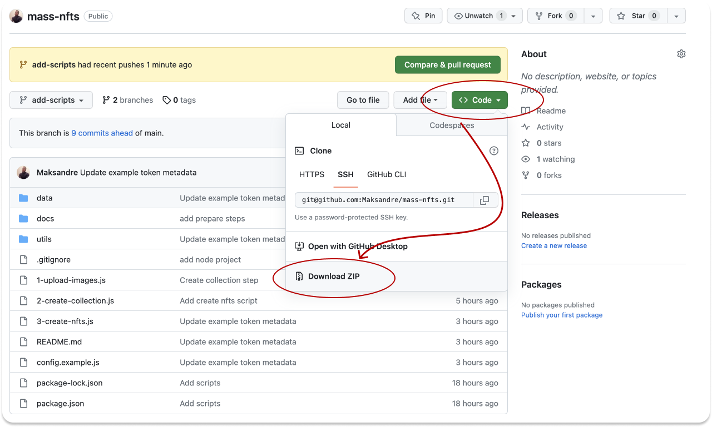
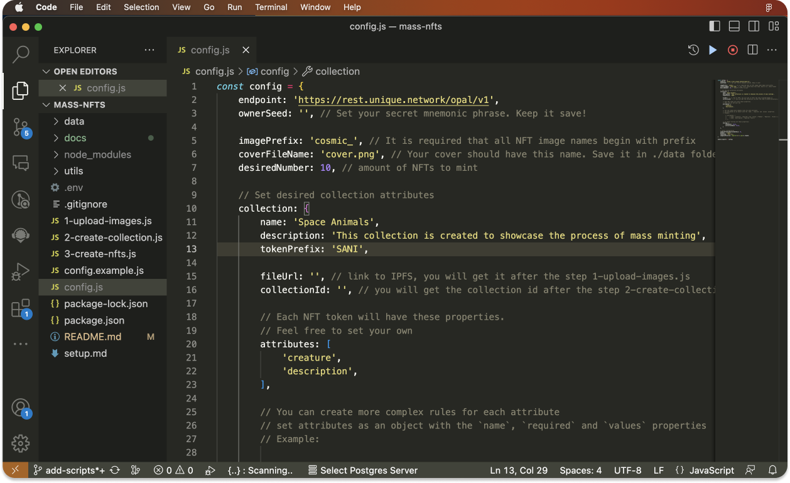

# Preparing scripts

Make sure you have already installed node, git and Visual Studio Code. If you haven't worked with git, node, and npm before, we recommend reading our [brief guide](./setup-environment.md) to configure your environment correctly.

### 1.1 Download the project

You may do it in two ways.

1. Using terminal. Open your terminal, `cd` to desired directory, and execute the following command:
```sh:no-line-numbers
git clone git@github.com:UniqueNetwork/mass-nfts-doc.git
```

2. Manually. Go to the [Github repository](https://github.com/UniqueNetwork/mass-nfts-doc) and download the project by clicking `Code - Download ZIP`. Unzip it after downloading.



After downloading the project, open it in Visual Studio Code. Click on `"File"` and select `"Open Folder"`. Then, choose the folder where the project was downloaded.

### 1.2 Install dependencies

In Visual Studio Code, access the built-in terminal by clicking on `"Terminal"` and then selecting `"New Terminal"`. Execute the following command:

```sh:no-line-numbers
npm install
```


Lastly, create a file named `config.js` in the root directory of your project and copy the contents from the `config.example.js` file into it. 

Congratulations! You're all set now. After following the previous steps, your project should resemble the screenshot below.



Now, let's proceed directly to the guides:

- If you already have images: [how to create a collection and mint a large number of tokens in less than 10 minutes](./mass-minting.md)
- If you want to create a collection such as CryptoPunks: [how to generate collection and tokens from image fragments](./generative-nft.md).
- If you want to create a customizable collection follow this guide: [Creating customizable NFTs](./customizable-nfts.md)