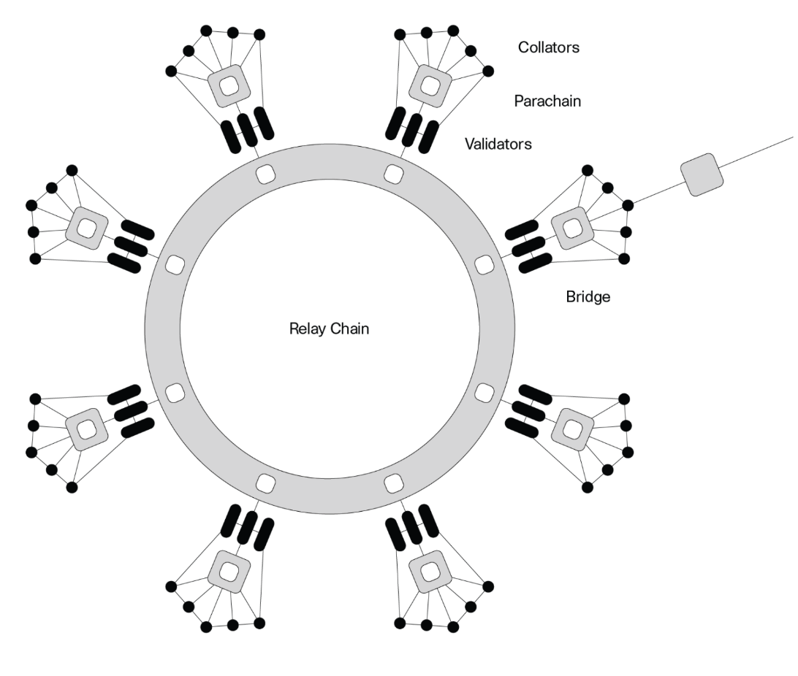

# Polkadot and Kusama

## Polkadot

Polkadot is a next-generation blockchain protocol connecting multiple specialized blockchains into one unified network.

Polkadot is built to connect and secure unique blockchains, whether they are public, permissionless networks, private consortium chains, or oracles and other Web3 technologies. This allows to have an Internet where independent blockchains can exchange information with common security guarantees.

**Scale**

Isolated blockchains can only process a limited amount of traffic. Polkadot is a sharded multichain network, which means it can process many transactions on several chains in parallel.

**Specialize**

When it comes to blockchain architecture, one size does not fit all. All blockchains make tradeoffs to support different features and use cases. For example, one chain might be optimized for identity management while another might be optimized for file storage. On Polkadot, each blockchain can have a novel design optimized for a specific use case.

**Work together**

Networks and applications on Polkadot can share information and functionality like apps on a smartphone, without needing to rely on centralized service providers with untrusted data practices. Unlike previous networks that operated mostly as standalone environments, Polkadot offers interoperability and cross-chain communication. This opens the door to innovative new services and allows users to transfer information between chains.

**Self-management**

The communities on Polkadot manage their network the way they need to and are very interested in the future of Polkadot network management in general. Teams can customize and adjust their blockchain management to their needs, experiment with new ideas, or swap in pre-built modules for faster deployment.

**Upgrade easily**

Like all software, blockchains need upgrades to stay relevant and improve over time. However, upgrading conventional chains requires what are called “hard forks”, which create two separate transaction histories that can divide a community into two parts and often take months of work. Polkadot enables forkless upgrades, allowing blockchains to evolve and adapt easily as soon as better technology becomes available.

**Bridges**

Polkadot also enables bridges to another network (like Ethereum ) for cross-network functionality and communication. 

Any questions remain? Please watch [this video](https://www.youtube.com/watch?v=_-k0xkooSlA&ab_channel=Polkadot) and check the resources below:

[Polkadot's lightpaper](https://polkadot.network/Polkadot-lightpaper.pdf)
[Polkadot's overview paper](https://github.com/w3f/research/blob/master/docs/papers/OverviewPaper-V1.pdf)
[Github](https://github.com/paritytech/polkadot/)

## Kusama

Kusama is a network built as a risk-taking, fast-moving ‘canary in the coal mine’ for its cousin Polkadot.

**Fast Iteration**
Move fast and ship your product. Kusama’s risk-taking and nimble mentality allow developers to move swiftly through the governance and upgrade process, enabling rapid development and growth.

**Low Economic Barriers**

Launch your custom blockchain (parachain) project with low barriers to entry. Ideal for lean startups looking to move fast and iterate.

**Advanced Technology**

You can build on a next-generation, sharded, multi chain network using the newest features before they are deployed on Polkadot.

**Open Governance**
Kusama is owned and governed by a community of network participants who vote on and control the evolution of the network. Have a voice and make your mark in the evolution of the network.

**Engaged Community**

You can leverage Polkadot’s global brand and developer community for your parachain, parathread or dApp.

**Innovation**

Kusama is built by the same teams as Polkadot, using nearly the same code and tools. The network places the latest tech from Parity Technologies and Web 3 Foundation in the hands of developers, even before those features make it to Polkadot.

**Scalability**

Kusama’s sharded blockchains and open governance provide a scalable and future-proof infrastructure for businesses, marketplaces, and applications to deploy and grow.

**Compatibility**

Kusama combines several blockchains into one sharded network, freeing developers from isolated blocks created by outdated blockchain networks.

**Customization**

With Substrate, developers can build their own app-specific blockchain and connect it to Kusama.

More resources about Kusama:

[Official blog](https://polkadot.network/tag/kusama/)
[Community Hub](https://www.notion.so/Polkadot-Kusama-Community-Hub-ee1fd077ff6c42c381940404f6aa9f1c)
[Meetup Hub](https://www.notion.so/Polkadot-Meetup-Hub-4511c156770e4ba9936386d8be5fe5be)
[Ambassador Program](https://unique.network/ambassador-application/)
[Github](https://github.com/paritytech/polkadot/)