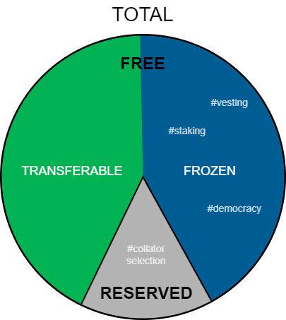
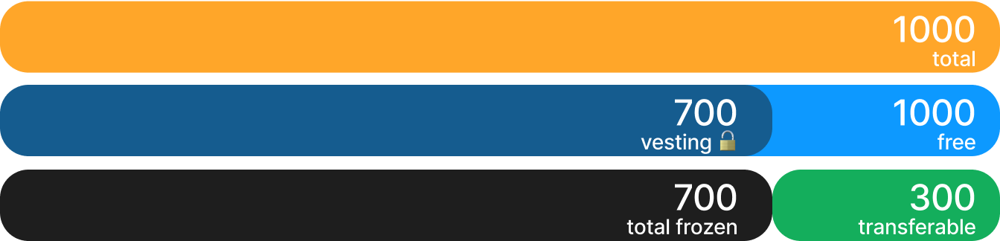
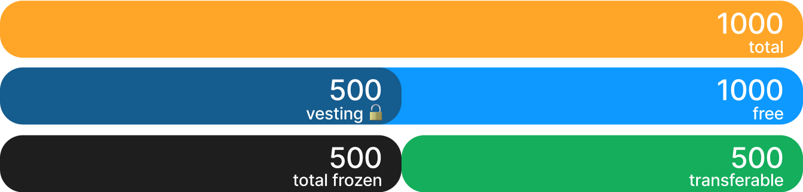
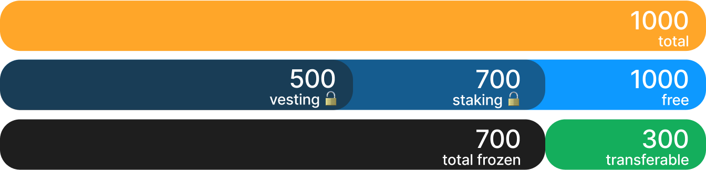
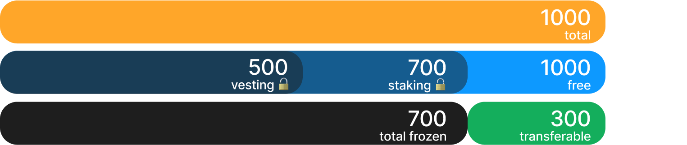
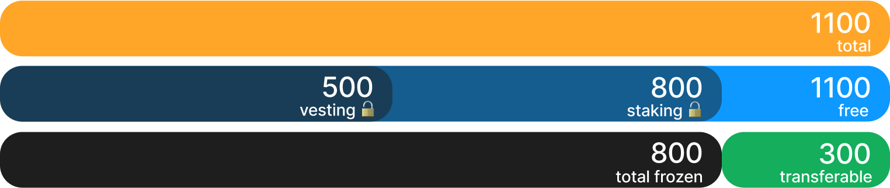
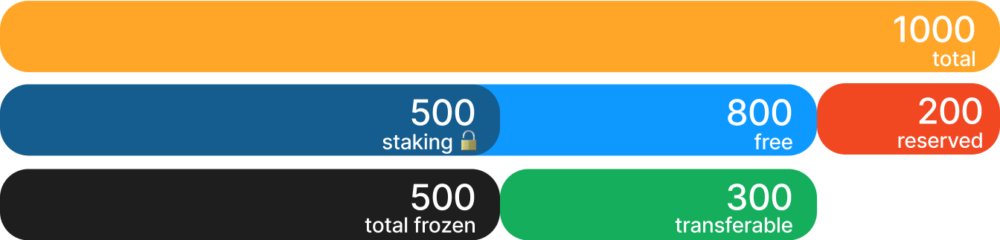

# Balances



## Total
All tokens that the user owns.

> Not all tokens included in the total are available to the user for transfers or extrinsic calls. Some of them may be [reserved](#_2-reserved), and some may be [frozen](#_1-2-frozen) (previously locked).

**How to get:**

`api.query.system.account`

```json
{
  nonce: 51
  consumers: 1
  providers: 2
  sufficients: 0
  data: {
    free: 133,637,366,777,247,975,283
    reserved: 1,000,000,000,000,000,000,000,000,000,000
    frozen: 100,000,000,000,000,000,000
    flags: 170,141,183,460,469,231,731,687,303,715,884,105,728
  }
}
```

> then add the fields `data.free` and `data.reserved`. In the example above, the total balance equals `1,000,000,000,133,637,366,777,247,975,283`

## 1. Free
The balance of the user that they can use to perform operations on the network. Some operations (such as staking) may not decrease this balance but may impose some restrictions on a part of it (see frozen).

**How to get:**

`api.query.system.account` - `data.free`

### 1.1 Transferable

A truly free balance. Tokens that the user can transfer to another account or use in any other way.

**How to get:**

Subtract [total frozen](#_1-2-frozen) balance from [free](#_1-free).

1. Get balances: `api.query.system.account`
2. Subtract: data.free – data.frozen

### 1.2 Frozen

This is the balance locked by the logic of some pallets.

Freezes are imposed on the free balance and do not reduce it; they only impose restrictions on transfer and payment of fees, reducing the transferable balance.

Every freeze has an ID. Possible reasons for the freeze:
- staking (`id: appstakeappstake`) 
- vesting (`id: ormlvest`) ❗️ Temporarily operates based on lock mechanisms. More about it is in the [vesting](#_1-2-1-vesting) section.
- democracy (in upcoming releases) 

Freezes with different IDs are not summed up - the total frozen balance is determined by the biggest freeze.
A balance frozen under any freeze ID can be frozen under another ID. For example, a balance frozen in vesting can be frozen in staking, provided the user has enough tokens to pay the transaction fee. In fact, there may be cases where the sum (for different IDs) of frozen balances exceeds the value of the free balance.

**How to get:**

`api.query.balances.freezes`

``` json
[
  {
    id: appstakeappstake
    amount: 100,000,000,000,000,000,000
  }
]
```

> Each separate freeze can be obtained by ID. The total frozen balance will be equal to the largest freeze in the list.

#### 1.2.1 Vesting

> ❗️ Vesting moves tokens to the locked state, not frozen! It acts similarly to the frozen state and will migrate to it eventually. To obtain the locks, execute "api.query.balances.locks"

`id: ormlvest`

Tokens are transferred to this state when using `api.extrinsic.vesting.vestedTransfer`. A typical example is the distribution of rewards for participating in a crowdloan.

To find out the vesting schedule, execute:

`api.query.vesting.vestingSchedules`

``` json
[
  {
    start: 13,710,000
    period: 1
    periodCount: 1,000,000
    perPeriod: 1,000,000,000,000,000,000
  }
]
```

> start: the block from which tokens begin to vest (unlock)
> 
> period: the duration of one vesting period in blocks
> 
> periodCount: the number of vesting periods
> 
> perPeriod: the number of tokens available for claim per period

>Starting from block `13,710,000`, each subsequent block for a period of `1,000,000` blocks makes available `1,000,000,000,000,000,000`, what equals 1 token (18 decimals), become available for vesting. One million tokens in total.


Unlocking does not happen automatically. The user must call `api.extrinsic.vesting.claim`. The amount of unlocked tokens will be calculated on the block when the transaction is made. In the example above, if the user makes a claim at block `#14,000,000`, then `290,000` tokens will be unlocked - one for each block since the start.

#### 1.2.2 Staking

`id: appstake`

The tokens enter this state when executing `api.extrinsic.appPromotion.stake`. The tokens are immediately transferred to the frozen state. The first reward will be available after one full staking period, which is `14,400` relay chain blocks (~1 day). If the transaction falls in the middle of the period, the first reward will be available after one period. To find out the exact block in which the next reward will be available, you need to call:

`api.query.appPromotion.staked`

``` json
[
  [
    [
      5GrwvaEF5zXb26Fz9rcQpDWS57CtERHpNehXCPcNoHGKutQY
      3,739
    ]
    [
      100,000,000,000,000,000,000
      28,800
    ]
  ]
]
```

> A user staked `100` tokens in relay block `#3,739`. The first staking period from block `#0 to #14,400` is not complete for the user, so they will not receive a reward for it. The first reward will be available at the end of the next period (blocks `#14,400 to #28,800`).

Rewards for stakers are accrued when calling the `api.extrinsic.appPromotion.payoutStakers` method. A new reward will be automatically frozen under the `id: appstake`. Each subsequent reward will take into account the previous rewards and will thus be slightly larger than the previous one.

The user has the right to stake tokens frozen by vesting or any other reason different than staking.

To unlock tokens, execute `api.extrinsic.appPromotion.unstakeAll` or `api.extrinsic.appPromotion.unstakePartial`. After unstaking, the tokens remain frozen under the `id: appstake` for the unstaking period, which is equal to `50,400` parachain blocks (~ 7 days). At the end of the unstaking period, the freeze is automatically removed, and no separate calls need to be made by the user. To find out the exact block in which the tokens will be unfrozen, call:

`api.rpc.appPromotion.pendingUnstakePerBlock`

``` json
[
  [
    2,182,233
    1,589,000,000,000,000,000,000
  ]
]
```

> In block `#2,182,233`, the freeze will be automatically removed from `1,589` tokens.

The user will not receive rewards for tokens waiting to be unfrozen.

## 2. Reserved
Reserved balance is a portion of the user's balance that is not available for any operations involving the user's funds. In Unique Network, funds are placed in this state when a user purchases a collator license.
 
**How to get:**

`api.query.system.account`

``` json
{
  nonce: 90
  consumers: 0
  providers: 2
  sufficients: 0
  data: {
    free: 267,650,597,011,312,913,686,135,054,997
    reserved: 1,000,000,000,000,000,000,000,000,000,000
    miscFrozen: 0
    feeFrozen: 0
  }
}
```

> Reserved balance is displayed in `data.reserved` field

## Cases

### 1. Claim of vested tokens

- Alice has 1000 tokens, out of which 700 are locked/frozen by vesting.
- Alice claims 200 tokens.

<!--  -->

**Result:**

- The free balance includes all locks, so it remains unchanged.
- The total frozen balance is calculated as the largest (and only) lock/freeze - vesting.
- The transferable balance is calculated as (free - total frozen), so it increases by 200 tokens.

Before:


After:



### 2. Vested tokens staking
- Alice has 1000 tokens, 500 of which are locked by vesting.
- Alice stakes 700 tokens. This is possible because the free balance, not the transferable balance, is important for a new lock/freeze (staking).

**Result:**

- Freezess do not reduce the free balance, which remains unchanged.
- The total frozen balance has increased and is now equal to the new largest lock - staking.
- The transferable balance has decreased due to the increased total frozen balance.

Before:


After:



### 3. Staking reward payout

- Alice has staked 700 tokens, and another 500 are locked/frozen in vesting.
- Alice has received 100 tokens as a reward for staking.

**Result:**

- The total and free balances have increased by 100 tokens.
- Rewards have been automatically frozen, so the staking freeze has increased to 800. When calculating subsequent rewards, the earned tokens will be taken into account. As a result, each reward will be slightly larger than the previous one.
- Since the staking freeze is the largest, the total frozen balance also increases to 800. 
- The transferable balance remains unchanged

Before:



After:



### 4. Reserving balances

- Alice has 1000 tokens, 500 of which are frozen by staking.
- Alice reserves 200 tokens for setting up Identity.

**Result:**

- Reserved balances reduce the free balance.
- The transferable balance is also reduced accordingly.
- Reserved balances cannot be used for any activities, including staking. Alice will not be able to stake more than 300 additional tokens.

Before:


After:


