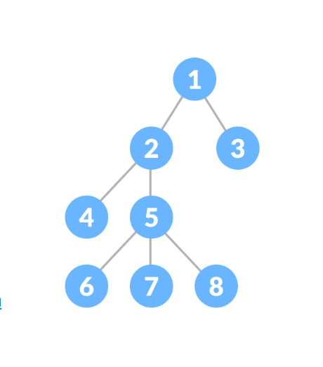

# Nesting and Bundling 

Nesting is a process of forming a structural relationship between two NFTs that form a parent-child relationship in a tree structure. Such a relationship is formed by forwarding token A2 to the address of token A1 by which A2 becomes a child of token A1 (conversely, token A1 becomes the parent of A2).

We can use the `tokenIdToAddress` function to obtain a token's address. As it will become apparent from the example code given below, we are constructing a valid and unique Ethereum address by incorporating the collection and token IDs into a 'root' Ethereum address.

A group of tokens nested within an NFT that can in turn be a nested, ordered, tree-like structure. This format is specifically applicable to NFT games and marketplaces because it allows developers to create novel NFT relationships.

For example, we can create a main-game-character NFT and then nest in-game items under it as a single convenient bundle.



<details>
    <summary> (click to expand)</summary>

```javascript
const { ethers } = require('ethers');
 
const tokenIdToAddress = (collectionId, tokenId) => {
 if (collectionId >= 0xffffffff || collectionId < 0) throw new Error('collectionId overflow');
 if (tokenId >= 0xffffffff || tokenId < 0) throw new Error('tokenId overflow');
 return ethers.utils.toChecksumAddress(
   `0xf8238ccfff8ed887463fd5e0${collectionId.toString(16).padStart(8, '0')}${tokenId.toString(16).padStart(8, '0')}`
 );
}
```
</details>
<br/>
We can perform the nesting simply by sending the token to this address by invoking a transfer call:
<br/>

```javascript
api.tx.unique.transfer({Ethereum: tokenIdToAddress(ACollectionId, A1TokenId)}, ACollectionId, A2TokenId, 1)
```

`ACollectionId` is the ID of the collection the NFTs A1 and A2 belong to and `A1TokenId` and `A2TokenId` are the individual tokens IDs (all of them integer numbers).

A prerequisite for nesting is that both the tokens must belong to the same owner.

Unnesting can be performed via a regular transfer call (transferFrom):

```javascript
api.tx.unique.transferFrom({Ethereum: tokenIdToAddress(ACollectionId, A1TokenId)}, {Substrate: newOwnerAddress}, ACollectionId, A2TokenId, 1)
```

Only the owner of the parent NFT (A1) can perform a withdrawal of the NFT from a bundle. By withdrawing a parent NFT, the whole branch of descendant tokens nested under is are also transferred (A1 can thus be viewed as a branch root).

The nesting depth of a bundle is limited to 5 generations (or 5 layers deep). As previously mentioned, a nested token must share a common owner with the root token.
