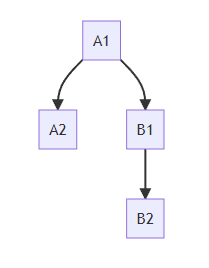
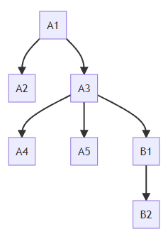

# Nesting and properties

[[toc]] 

### Nesting settings

By default, nesting for a collection is disabled. To enable it we need to change the nesting rule. The Nesting rule is a part of the collection permissions.

```javascript
api.tx.unique.setCollectionPermissions(ACollectionId, {
   nesting: {tokenOwner: true}
});
```

With the nesting enabled, tokens can be nested as long as they share a common owner, but they can belong to different collections. So in a case where tokens A1 and  B1 share a common owner, a token from collection B (B1) can be nested under a token in collection A (A1). To reiterate an important point, the collections need not have a common owner.

However, this behavior can be restricted by imposing a list of allowed collections. This would ensure that only tokens from a restricted list of collections (defined by the collection IDs) can be nested:

```javascript
api.tx.unique.setCollectionPermissions(ACollectionId, {
   nesting: {tokenOwner: true, restricted: [ACollectionId, BCollectionId]}
);
```

This behavior can be reset by passing _null_ as a restricted list argument:

```js
api.tx.unique.setCollectionPermissions(ACollectionId, {
   nesting: {restricted: null}
);
```

You can extend the rights of nesting to collection administrators if any have been declared. When an administrator enables nesting, the owner of the collection is implicitly given nesting rights as well.

```javascript
api.tx.unique.setCollectionPermissions(ACollectionId, {
   nesting: {collectionAdmin: true}
);
```

Administrators can nest only tokens owned by them to the managed collection’s tokens. However, they can nest into a token that is owned by someone else (owner or another administrator). If an administrator imposes a collection restriction list, this list will also extend to the owner, i.e. the owner must also obey collection restriction rules set forth by the administrator.

To disable nesting we would use:

```javascript
api.tx.unique.setCollectionPermissions(ACollectionId, {
   nesting: {tokenOwner: false, collectionAdmin: false}
});
```

Once nesting is disabled, it will not be possible to nest new tokens into the bundle. The nested structure remains accessible to the root owner. Changing the nesting rule property does not affect the existing structure of the bundle in any way.


## RPC Methods

### 🔶 topmostTokenOwner

Obtain the root token owner for a token in a nested branch.

```javascript
api.rpc.unique.topmostTokenOwner(collectionId, tokenId)
```

Example: If in a case where _User_ is the owner of token A that has a nested child token B, that in turn has a nested child token C, this function is invoked with token C as the argument, it would return as the result the owner of token A, i.e. _User_.


### 🔶 tokenChildren

Obtain a list of all the direct descendants of a given token. A direct descendant is a child nested one layer deep.

```javascript
api.rpc.unique.tokenChildren(collectionId, tokenId)
```

The response obtained by invoking the call has the format:
> {token: childTokenId, collection: childTokenCollectionId}

Example: Let's consider a nested structure where tokens A1 and A2 belong to collection A and token B1 belongs to collection B

[//]: # (```mermaidjs)
[//]: # (graph TD;)
[//]: # (    A1-->A2;)
[//]: # (    A1-->B1;)
[//]: # (    B1-->B2;)
[//]: # (```)



By invoking this function with the ids of collection A and  token A1, a response would be:


>[{token: A2, collection: A}, {token: B1, collection: B}]

As presented in this example the `tokenChildren` lists only A1 and B2 as they are direct, or first generation, or layer 1 of nesting depth descendants. Token B2 is a second generation descendant, or a layer 2 nested token. However, B2 will appear as a result of a call invoked with ids for collection B and token B1.

## Notes

Only a leaf node token in a bundle can be burned. A leaf node is a token that belongs to a branch and has no descendants. This rule implies that in order to burn a root of a branch you must burn all the leaf nodes in sequence first.

So in the example provided below, to burn the token A3 which is the root of a branch of descendants A5, A4, B1 and B2 it would be necessary to disassemble the branch, i.e. to burn the tokens in a specific order: B2, B1, A4, A5, A3.

[//]: # (```mermaidjs)
[//]: # (graph TD;)
[//]: # (    A1-->A2;)
[//]: # (    A1-->A3;)
[//]: # (    A3-->A4;)
[//]: # (    A3-->A5;)
[//]: # (    A3-->B1;)
[//]: # (    B1-->B2;)
[//]: # (```)



Non-empty collections cannot be burned.


## Collection and Token Properties

Properties (hereinafter also referred to as 'parameters') of NFT collections and tokens are implemented in the blockchain as a BTreeMap data storage block.

Furthermore, this BTreeMap consists of a unique set of keys and values which are defined by the owner or administrator of a collection.

Each token of a collection inherits a list of common key/value pairs that can be attributed/set for that token and that are defined for that collection (listed in `tokenPropertyPermissions` - see below). A token cannot be attributed an arbitrary key, only a key from this list. But setting of an attribute's value is optional. An attribute can remain 'unset', i.e. there is no default value that is automatically set for a newly created token. If the user has the permissions that allow setting of properties, they may set and change the values of the token's keys.

The parameter block is restricted by both the data size and the number of keys. The maximum number of keys is 64 for both the collections and tokens. The maximum size of a parameter data block (keys and values) for a collection is 40kB and for a token 32kB.

Key naming is restricted to a limited set of the following characters: Latin letter any case, numbers, dot, hyphen and underscore (regex: ^[0-9a-zA-Z\.\-_]).

Only the owner and designated administrators can modify the properties of a collection.

Access to changing token parameters is based on access rights to token keys stored in the collection (`tokenPropertyPermissions`).

Only the owner and designated administrators of a collection can add and modify keys.

Keys can only be added. To avoid token corruption, a key cannot be removed once it is created/added. Although keys can't be deleted we can delete the values attributed to a key if the key is mutable.

A value of a key can be changed by the owner/administrator only if it has not been declared as an immutable key ('mutable' attribute set to _false_).

A note on the mutability attribute: if it is set to _false_ token data can only be set once. Immutable data stays immutable forever. Furthermore, the mutable attribute can be changed only from _true_ to _false_. Changing it from _false_ to _true_ is not possible.

In summary, the configuration or permissions to create and modify properties of a collection is carried out using three keys - `mutable`, `collectionAdmin` and `tokenOwner`.

- `mutable` attribute sets the immutability attribute.
- `collectionAdmin` grants the designated collection administrator and the collection owner 'write/modify' access
- `tokenOwner` grants the token owner 'write/modify' access


## RPC Methods

### 🔶 collectionProperties

Obtain collection properties array.

```javascript
api.rpc.unique.collectionProperties(collectionId)
```

Returns an array of objects: `{key: string, value: string}`

### 🔶 propertyPermissions

Get property permissions array.

```javascript
api.rpc.unique.propertyPermissions(collectionId)
```

Returns an array of objects: `{key: string, permission: {mutable: bool, tokenOwner: bool, collectionAdmin: bool}}`

### 🔶 tokenData

Get token data.

Invoke:

```javascript
api.rpc.unique.tokenData(collectionId, tokenId)
```
with key `properties`.

### 🔶 tokenProperties

Token properties can also be obtained via the dedicated `tokenProperties` method:

```javascript
api.rpc.unique.tokenProperties(collectionId, tokenId)
```

Returns an array of objects: `{key: string, value: string}`

## Migrations for Existing Quartz Collections

These collection fields have been deprecated and are not supported with the most recent upgrade to the blockchain:
- `schemaVersion`
- `offchainSchema`
- `constOnChainSchema`
- `variableOnChainSchema`

For the existing collections, these fields have been moved to the corresponding property keys prefixed by '\_old\_'.

The following token fields have been deprecated and are no longer supported with the new properties schema:
- `variableData`
- `constData`

For the existing tokens, `constData` has been moved to `_old_constData`.
  