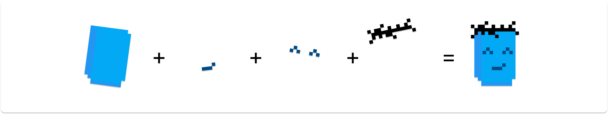
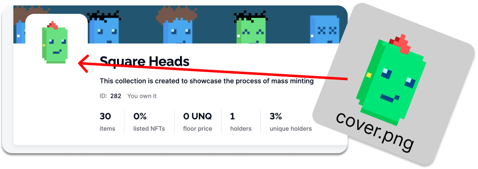
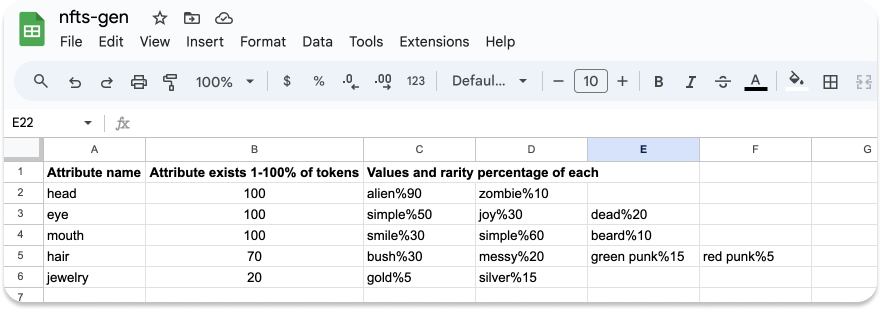
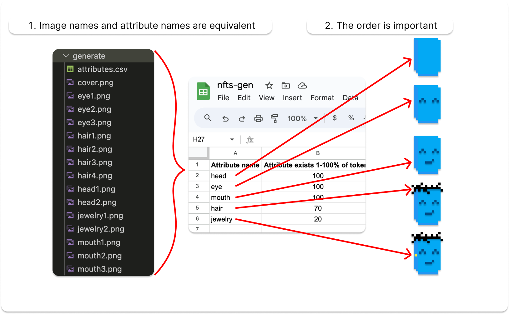
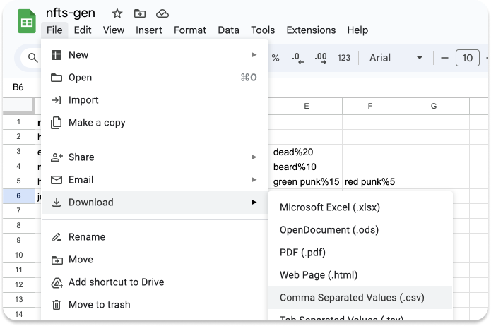
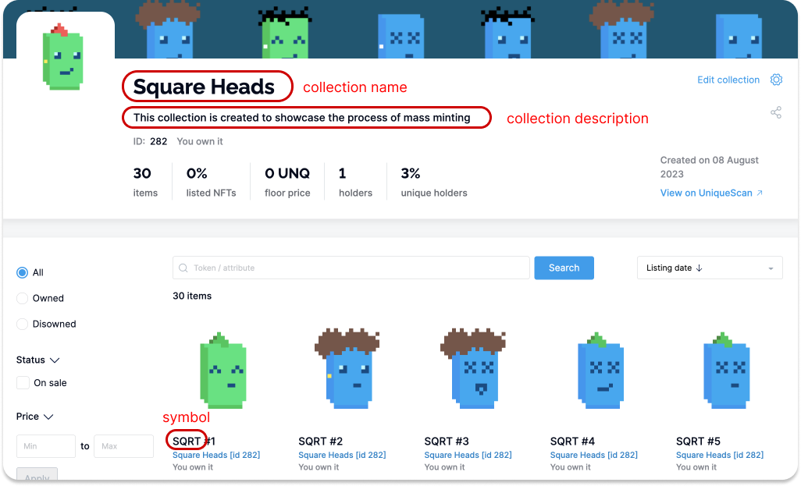
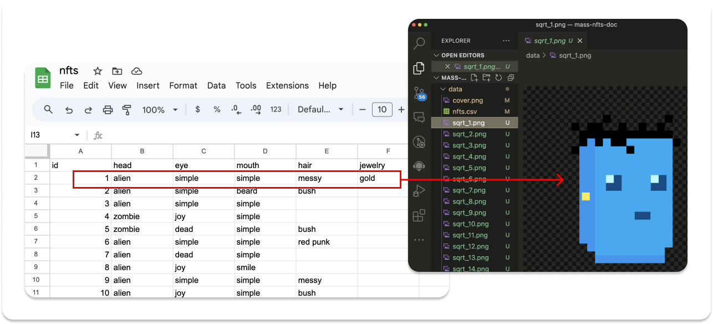
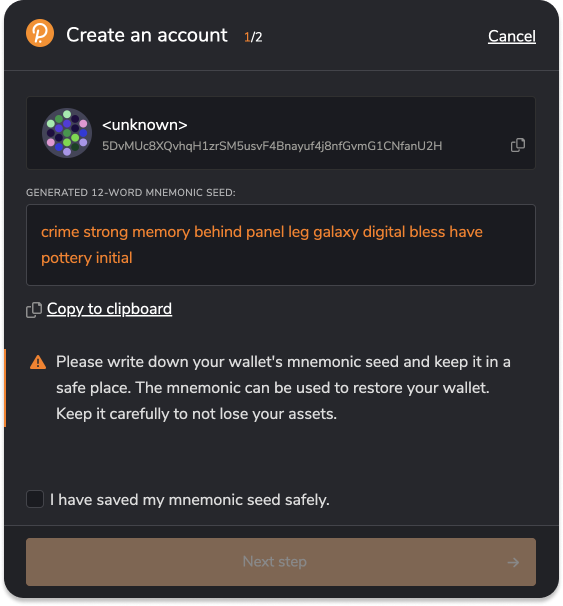
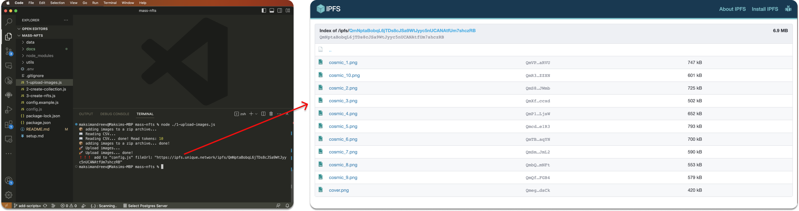

# Generative NFT Guide

## 👩‍🎓 Who is this guide for

Generative NFTs represent a unique art form generated through computer algorithms. These NFTs are crafted by combining distinct attributes, such as head, eyes, mouth, etc., in a randomized manner.

This guide is intended for those who want to understand how to automatically generate a collection similar to [Substrapunks](https://unqnft.io/unique/collection/1?filterState=) from image fragments. If you already have images follow [this tutorial](./mass-minting.md) instead.

This guide is perfect for beginners who don't have extensive programming knowledge. However, having some familiarity with using the terminal will be helpful.

By completing this tutorial, you will have a clear understanding of how to use scripts to generate images and NFT metadata and mint vast collections, illustrated through the example of the [Square Heads collection](https://unqnft.io/unique/collection/282?filterState=).


## Before we start

1. For this tutorial, you will need node.js, git, and Visual Studio Code installed on your computer. If you haven't worked with git, node, and npm before, we recommend reading our [brief guide](./setup-environment.md) to configure your environment correctly.
2. Prepare minting scripts according to [this instruction](./prepare-scripts.md)

## 🖼 Step-1: Prepare the images



### 1.1 Design image parts

The image parts should generally include some combinable details with transparent backgrounds. Store them in the `generate` folder. For this example, we have already provided a certain number of images. Feel free to use them or replace them with your own.

> 💡 Please ensure that your images meet the following criteria:
>
> 1. All images have the same length and width.
> 2. The images have a transparent background (use png format).
> 3. The images are positioned in a way that they form a cohesive image when overlaid.
> 4. The image filenames should follow the format {attribute-name}{index}.png, for example, eye1.png, eye2.png.

### 1.2 Set collection cover

Place an image named `cover.png` in the `generate` folder, which will serve as the cover image for the collection. We have already provided a cover. You can either keep it or replace it with your own.



## 👨‍🎨 Step-2: Describe NFT attributes

### 2.1 Encode attributes

Generally, combinable parts produce NFT traits. For example, if the `eye2.png` image is used to generate the NFT image, it will have `joy` trait.

It is also essential to consider the rarity of attributes. For example, we want every token to have a `head` trait, but `head2.png` should be rare and appear on only about 10% of the tokens. The `jewelry` trait should be present in only 20% of the NFTs, with `jewelry1.png` appearing in 5% and `jewelry2.png` occurring in the remaining 15%.

We will use [Google Sheets](https://docs.google.com/spreadsheets/d/1BkBtTPcy_lvP1X23qdBQ13qQMVwirS4ZjBApp3sLbVU/edit#gid=0) to populate attributes. Here is how to code this:



In the `Attribute name` column, list all the possible attributes encoded in the images added in Step 1.1.

Make sure:

1. The attribute names must match the names of the images.
2. The order of attributes is crucial. For example, `head` is the base image onto which all others are overlaid, so it should be listed first. `eyes`, `mouths`, and `hair` are overlaid on top of the `head`, and since they do not intersect with each other, they can be arranged in any order. If our tokens had accessories, like glasses overlaying the eyes, they should be listed below the eyes. Otherwise, we might end up with images where the eyes are overlaid on top of the glasses.



In the `Attribute exists 1-100% of tokens` column, indicate the probability percentage with which each attribute will be present. For example, `head`, `eye`, and `mouth` are mandatory attributes with a probability set at `100`%. `hair` will appear in only 70% of the tokens, while jewelry will be present in only 20%.

In the subsequent columns, list the names of attributes and their probability of occurrence among the tokens.

Make sure:

1. The order of listing attributes is crucial and should correspond to the sequential number of the corresponding image. For example, `hair1.png` corresponds to the attribute `bush`, `hair2.png` corresponds to `messy`, and `hair3.png` corresponds to `green punk`. Therefore, the order in the table should be exactly as follows: `bush`, `messy`, `green punk`.
2. Specify the probability of each attribute's occurrence for individual NFTs. For example, for `bush`, the likelihood of occurrence is set to `30%`, and for `messy`, it is set to 20%, `green punk` 15%, `red punk` - 5%. The final values will appear as follows: `bush%30`, `messy%20`, `green punk%15`, `red punk%5`. The cumulative probability set in the `Values and rarity percentage of each` column should match the probability set in the `Attribute exists 1-100% of tokens` column.


Export the table to CSV format by clicking on `File - Download - Comma Separated Values (.csv)`



> ✏️ Rename the exported file to `attributes.csv` and save it in the `generate` folder near the images' parts.

### 2.2 Set the collection metadata



> ✏️ In the `config.js` file, fill in the fields `collectionName` (max 64 symbols), `collectionDescription` (max 256 symbols), and `symbol` (max 4 symbols).
>
> If you want to make nesting available for your collection, set the `nesting` property. [Read more about nesting](https://docs.unique.network/networks/nesting.html).

### 2.3 Generate images and metadata

> ✏️ Set the desired number of generated NFTs in the config.js file and fill in the `desiredCount` property.

Open the VS Code terminal, as we did in step 1.2, and run the following command:

```sh:no-line-numbers
node 0-generate-nfts.js
```

The images in the `data` folder will be replaced with randomly generated ones. Please verify that the generated images are correct.

Additionally, a file named `nfts.csv` with the listed properties of future tokens will be added to the `data` folder. Please check that the generated images match the description. For convenience, you can upload the `nfts.csv` file to Google Sheets. Select "File - Import" and upload the `nfts.csv` file.

Each row in the spreadsheet should correspond to a generated image with the same sequential number.



## ⛓ Step-3: Prepare Substrate Account

### 3.1 Generate address and seed phrase

You will need an address with a balance to create the collection and tokens. If you don't have an account yet, you may create it with [Polkadot{.js} extension for Chrome](https://polkadot.js.org/extension/).

- Open the Polkadot{.js} extension in your browser.
- Look for the "+" icon and click on it.
- A menu will appear. From the options presented, select "Create new account".
- A 12-words mnemonic phrase will be generated. Make sure to save it securely.



> ✏️ In the `config.js` file, fill in the `ownerSeed` field.
>
> ❗️ Do not commit your secrets, such as `ownerSeed`, to version control! We have added `config.js` to the `.gitignore` file for this purpose.

### 3.2 Get some tokens

For this guide, we are using Opal Network, and you can obtain OPL tokens for free by using [Telegram faucet bot](https://t.me/unique2faucet_opal_bot). You will have to provide your address (not a mnemonic phrase!). Click on the circle icon next to your account in the Polkadot extension to copy it.

> 💡 If you are ready to mint tokens on the mainnet, change the endpoint variable in the config.js file. Set it to `https://rest.unique.network/v2/unique`.
>
> Unique Network tokens (UNQ) are available on [Hydration](https://app.hydration.net/trade/swap?assetIn=10&assetOut=25)

Now everything is ready to create a collection and tokens.

## 💎 Step-4: Create Collection and NFTs

### 4.1 Upload images to IPFS

In simple terms, the Inter-Planetary File System (IPFS) is a distributed file storage protocol that enables a network of computers to store any data in a reliable and unchangeable manner.

```sh:no-line-numbers
node 1-upload-images.js
```

After a short time, you will see the result of executing the command:



This script will pack all the images into a zip archive and save it as data/archive.zip. Then it will upload it to IPFS. Ensure all your files are successfully uploaded by visiting the link provided in the console output.

> ✏️ In the `config.js` file, fill in the `fileUrl` set provided link.

### 4.2 Create a collection

We have set the collection metadata in the previous steps. Double-check that the name, description, and symbol fields are filled in `config.js`. Afterward, execute the script.

```sh:no-line-numbers
node 2-create-collection.js
```

After a short time, you will see the result of executing the command:

```
🚀 Creating collection... done!
❗️❗️❗️ add to "config.js" collectionId: 2015
```

> ✏️ In the `config.js` file, fill in the `collectionId` set provided value.

Your collection has been created, and you can check it on your [wallet](https://wallet.unique.network/) or on [uniquescan.io](https://uniquescan.io/). Your collection doesn't have any NFTs yet, so let's create some.

### 4.3 Create NFTs

We have set the token metadata in the previous steps in the nfts.csv file. Check again if it exists. After that, execute the following script.

```sh:no-line-numbers
node 3-create-nfts.js
```

After a short time, you will see the result of executing the command:

```
🚚 successfully created 1 part of NFT's
🚀 Creating NFTs... done!
Token Ids: 1, 2, 3, 4, 5

🔗 You can find your collection and tokens here: https://uniquescan.io/opal/collections/2015
```

Your collection and tokens have been successfully created! You can find it in your [wallet](https://wallet.unique.network/). Or you can connect to [Unique Market](https://unqnft.io/) and list your NFTs for sale.

Next, you can learn

[How to mass list tokens for sale](./mass-listing.md)
