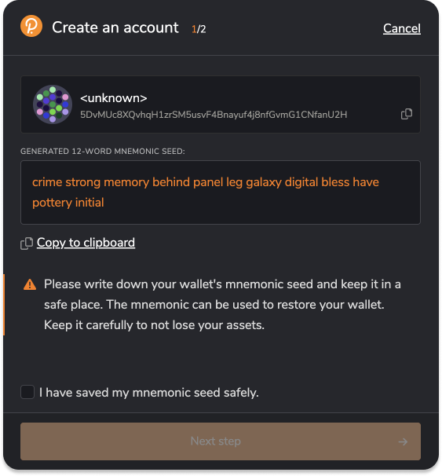

# Getting Account and OPL Tokens

## Generate address and seed phrase

You will need an address with a balance to create the collection and tokens. If you don't have an account yet, you may create it with [Polkadot{.js} extension for Chrome](https://polkadot.js.org/extension/).

- Open the Polkadot{.js} extension in your browser.
- Look for the "+" icon and click on it.
- A menu will appear. From the options presented, select "Create new account".
- A 12-words mnemonic phrase will be generated. Make sure to save it securely.

> ❗️ Save your seed phrase and keep it safe!

## Get some tokens

For this guide, we are using Opal Network, and you can obtain OPL tokens for free by using [Telegram faucet bot](https://t.me/unique2faucet_opal_bot). You will have to provide your address (not a mnemonic phrase!). Click on the circle icon next to your account in the Polkadot extension to copy it.

You can check your tokens in the [wallet](https://wallet.unique.network)