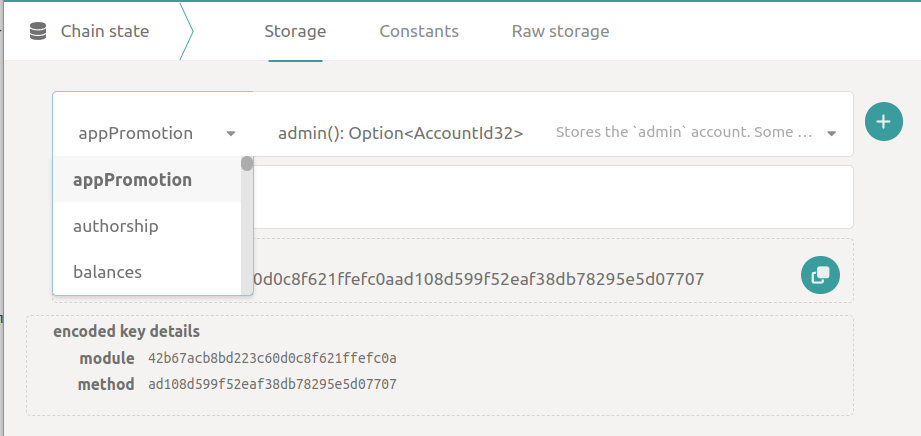
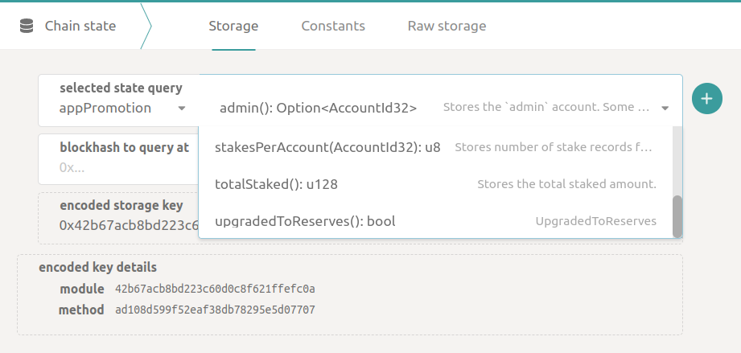
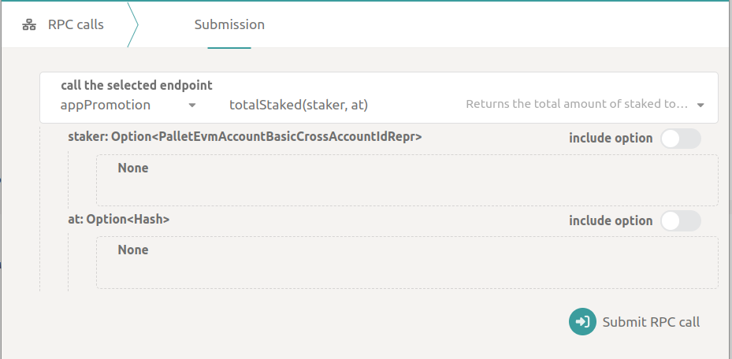
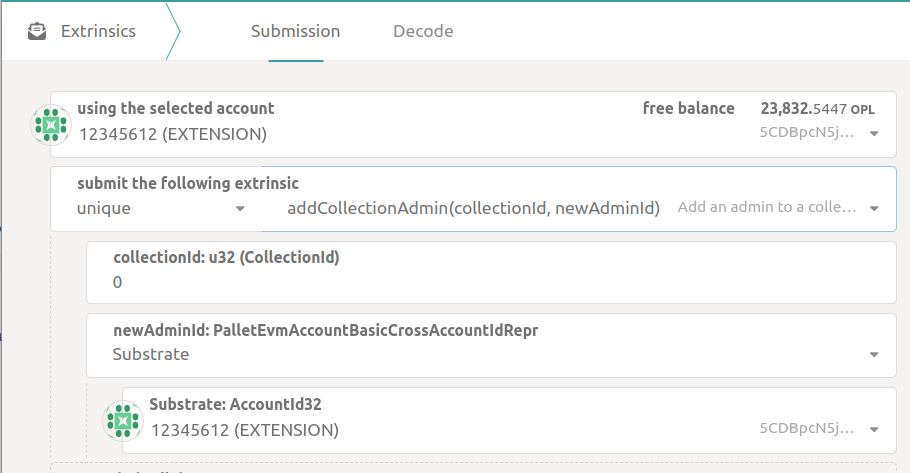
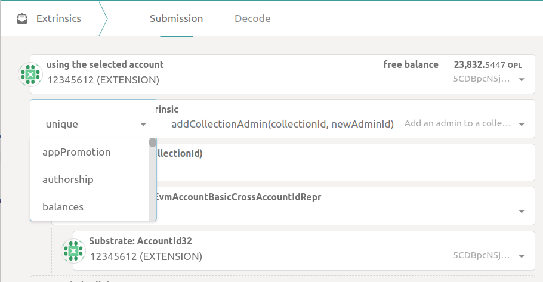
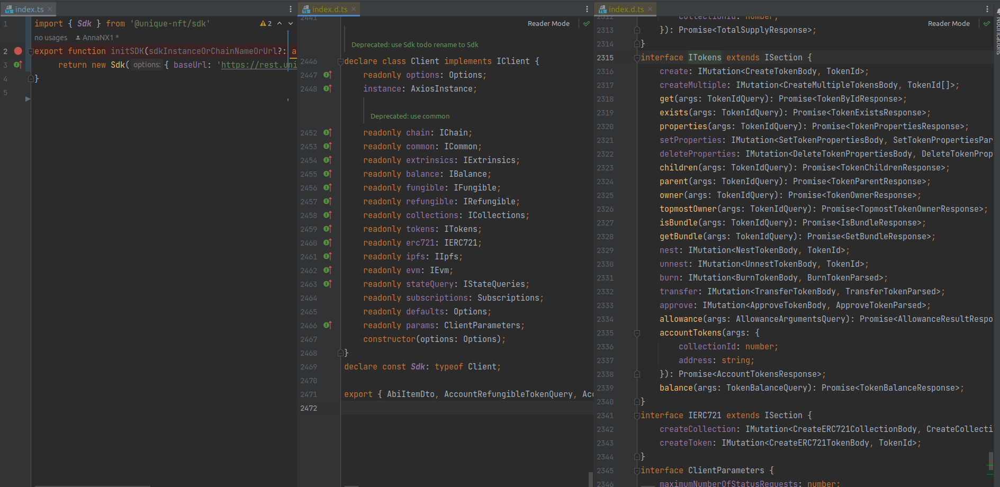
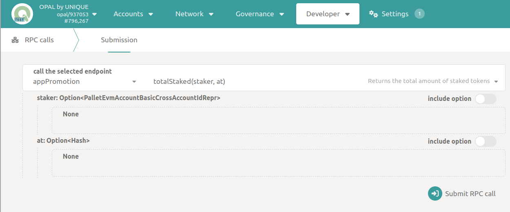
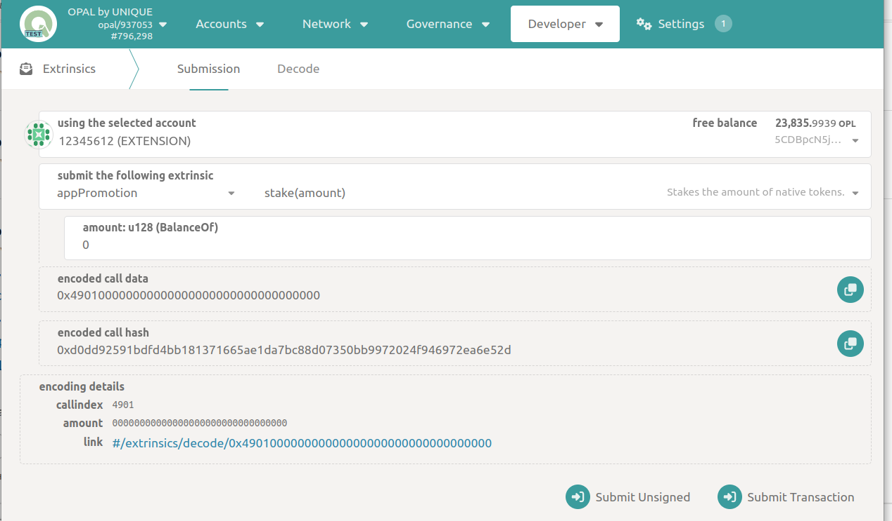
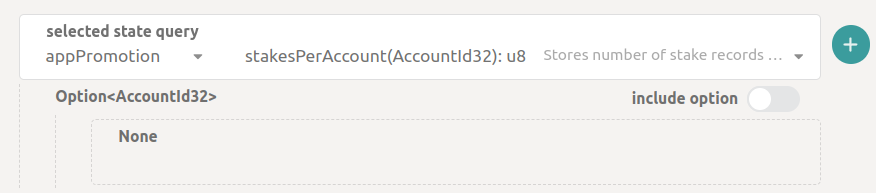

# Universal call of chain methods via SDK

[[toc]]

## Prerequisites

A complete list of chain methods (**Chain state**, **RPC call** and **Extrinsic**) can be found in the [Polkadot GUI](https://polkadot.js.org/apps/?rpc=wss%3A%2F%2Fws-opal.unique.network).

For the most commonly used methods of chain, the SDK has wrapper functions to calling them.
Wrapper functions help validate input data and present the result of a method call in a user-friendly way
(analyze the result of an RPC call and listen to blocks with extrisic, parse the events in the block to generate human-friendly output).

Chain methods that are not explicitly described in the SDK can still be called through the SDK.

**Chain state** and **RPC call** are called with `sdk.stateQuery.execute` method.

For **extrinsic** you need use `sdk.extrinsics` method.

## Chain state, RPC call, Extrinsic in Polkadot GUI

[Chain state page](https://polkadot.js.org/apps/?rpc=wss%3A%2F%2Fws-opal.unique.network#/chainstate) shows all available requests.

In the picture, select the `module` for the **Chain state** request.



After selecting a `module`, you will get the entire list `methods` for that `module`.



[RPC call page](https://polkadot.js.org/apps/?rpc=wss%3A%2F%2Fws-opal.unique.network#/chainstate) shows all available requests.
Simuliarly, on this page you can view all `modules` and their `methods`.

Below `module` and `method` you can see the parameters for requests.
For the `totalStaked` method, the parameters are `staker` and `at`.



[Extrinsic page](https://polkadot.js.org/apps/?rpc=wss%3A%2F%2Fws-opal.unique.network#/extrinsics) shows all available requests in chain.



Simuliarly, you may select `section` and `method` on this page.


## List methods in SDK

All methods available in the SDK are described in the [documentation](./methods.md).

Thanks to TypeScript, you can view all the modules and method signatures that the SDK contains.



## Query a Chain state or an RPC call via the SDK

For example, consider the `totalStaked` method. This is from the `appPromotion` module.

Find this method in [polkadot.js.org](https://polkadot.js.org/apps/?rpc=wss%3A%2F%2Fws-opal.unique.network#/rpc):



Calling this method with the SDK would look like this:

```typescript
  import { Sdk } from '@unique-nft/sdk'
  const sdk = new Sdk({ baseUrl: 'https://rest.opal.uniquenetwork.dev/v1' })
  const result = await sdk.stateQuery.execute(
    {
      endpoint: 'rpc',
      module: 'appPromotion',
      method: 'totalStaked',
    },
    { args: [{ Substrate: '5CDBpcN5jAYiHtUoMmb2PhUE8WVG7xPYcbBWZuAd2MkMXgoC' } as any] },
  )
```

Input parameters for calling the request:

- The `endpoint` parameter is `query` for **Chain state** and `rpc` for **PRC call**.

- The `module` argument must contain the pallet name.

- In the `method` argument, you must pass the name of the chain method.

- In the `args` field, you must pass an array of parameters for a particular method.
You can find out the parameters of a particular method, their type and optionality using [polkadot.js.org](https://polkadot.js.org/apps/?rpc=wss%3A%2F%2Fws-opal.unique.network#/rpc).

## Executing an extrinsic via the SDK

Consider the `stake` method. This is from the `appPromotion` section.

Find this method in [polkadot.js.org](https://polkadot.js.org/apps/?rpc=wss%3A%2F%2Fws-opal.unique.network#/extrinsics):



Calling this method with the SDK would look like this:

```typescript
  import { Sdk } from '@unique-nft/sdk'
  import Extension  from '@unique-nft/utils/extension'
  const enablingResult = await Extension.Polkadot.enableAndLoadAllWallets()
  const accounts = enablingResult.accounts
  const sdk = new Sdk({
    baseUrl: 'https://rest.opal.uniquenetwork.dev/v1',
    signer: accounts[0].uniqueSdkSigner
  })
  const result: any = await sdk.extrinsics.submitWaitResult(
    {
      address: accounts[0].address,
      section: 'appPromotion',
      method: 'stake',
      args: ['100000000000000000000'],
    }
  )
```

Input parameters for calling the request:

- The `address` argument contains the signer's address.

- The `section` argument must contain the name the module.

- In the `method` argument, you must pass the name of the method

- In the `args` field, you must pass an array of arguments for a particular method.
  You can find out the parameters of a particular method, their type and optionality using [polkadot.js.org](https://polkadot.js.org/apps/?rpc=wss%3A%2F%2Fws-opal.unique.network#/extrinsics).

## Example types in Polkadot GUI

Some examples pass parameters via `args`.

- In the `AccountId32` type parameter, you need to pass the Substrate address.

`Option` denotes an optional parameter.



```typescript
{args: ['5CDBpcN5jAYiHtUoMmb2PhUE8WVG7xPYcbBWZuAd2MkMXgoC']}
```

- A number is expected in the `amount: u128` type parameter.
It's better to pass the number as a string to avoid the number rounding error in JavaScript.

```typescript
args: ['100000000000000000000'],
```

- In the `PalletEvmAccountBasicCrossAccountIdRepr` type parameter, you need to pass an object containing the address.

```typescript
{ args: [{ Substrate: '5CDBpcN5jAYiHtUoMmb2PhUE8WVG7xPYcbBWZuAd2MkMXgoC' } as any] },
...
{ args: [{ Ethereum: '0xA4f4590Ad25014950995B9e75740275DF9df7375' } as any] },
```


