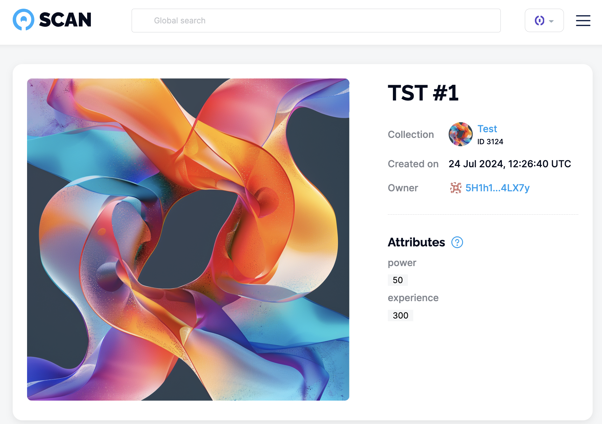

# NFTs

::: warning
The Unique SDK v2 is in alpha and may contain bugs or incomplete features. For production use or to access more stable functionality, please refer to the [documentation for the previous version](../getting-started.md) of the SDK.
:::

[[toc]]

## Intro 

An NFT, or non-fungible token, represents a unique digital asset that cannot be replaced or exchanged on a one-to-one basis. NFTs can take many forms, such as JPEG images, music, or digital artwork. For example, as an artist, you could create a 3-minute YouTube video by combining your images and music. Once created, you can sell this video as an NFT, potentially at a great price if it offers value to the community. It's similar to purchasing art at a gallery, but it's a much simpler and more accessible process.

## Prerequisite

Follow the [Getting started guide](./quick-start.md) to install required libraries, receive test network OPL tokens, and initialize SDK.

At this point, you need to know how to manage collections. Learn how to do this in the [Working with collections](./collections.md) guide.

## Getting started

Let's start with a minimum example. At this point, we assume you already minted your NFT collection, and you have its `collection`. 

```ts:no-line-numbers
const mintNftTx = await sdk.token.mintNFTs({
  collectionId,
  tokens: [
    {data: {image: 'https://gateway.pinata.cloud/ipfs/QmTkhTg5S5zrqJL3UsKtyiFi8fcMT3Cao9uKtadp3Ckh7m'}},
    {data: {image: 'https://gateway.pinata.cloud/ipfs/QmQRUMbyfvioTcYiJYorEK6vNT3iN4pM6Sci9A2gQBuwuA'}},
  ]
});

const [nft1, nft2] = mintNftTx.result;

console.log('Minted tokens:', nft1.tokenId, nft2.tokenId);
```

Check your newly created tokens on [Unique Scan](https://uniquescan.io/opal/tokens/nfts)

## Token properties and attributes

In the collections section, we've learned [basics about token properties](./collections.md#token-property-permissions). Let's do a quick recap.

1. Token property is a key/value pair
2. The list of possible keys, as well as their mutability, are set on the collection level

<!-- TODO intro about properties and attributes what is the difference -->

### Properties

Now, let's create a token and set its properties.

```ts:no-line-numbers
// This is an example of a collection created in the collection section
const {result} = await sdk.collection.create({
  name: "Test",
  description: "Test collection",
  symbol: "TST",
  info: {cover_image: {url: coverImage}},
  tokenPropertyPermissions: [ // <--- set token property permissions here 
    {key: 'A', permission: {mutable: true, collectionAdmin: true, tokenOwner: true}},
    {key: 'B', permission: {mutable: false, collectionAdmin: false, tokenOwner: false}},
    {key: 'C', permission: {mutable: false, collectionAdmin: false, tokenOwner: true}},
  ]
});

const nftImage = "https://gateway.pinata.cloud/ipfs/QmTkhTg5S5zrqJL3UsKtyiFi8fcMT3Cao9uKtadp3Ckh7m";

const mintNftTx = await sdk.token.mintNFTs({
  collectionId: result.collectionId,
  tokens: [
    {data: {image: nftImage}, properties: [{key: "A", value: "value A"}]},
  ]
});
```

In the example above, we created only one NFT and set only one property—`A`.

Later, the NFT owner can specify property `C`.

```ts:no-line-numbers
await sdk.token.setProperties(
  {
    collectionId,
    tokenId: mintNftTx.result[0].tokenId,
    properties: [{key: "C", value: "value C"}]
  }
);
```

But because of permissions of property `B` it could have been set only during the minting. So it will remain unset forever.

### Attributes

Properties are a part of a token on a core blockchain level. They can be set with arbitrary metadata, i.e., schema name and version, royalties, etc.

Attributes define token traits and are not a part of a blockchain core. Examples of attributes could be a `power` or `experience` for a gaming character. In Unique Schema, attributes are stored in `tokenData` property of an NFT.

Let's mint some extra tokens with attributes.

```ts:no-line-numbers
const mintNftTx = await sdk.token.mintNFTs({
 collectionId: result.collectionId,
 tokens: [
  {
    data: {
      image: nftImage,
      attributes: [ // <--- setting attributes
        {trait_type: "power", value: 50},
        {trait_type: "experience", value: 300}
      ]
    }
  },
 ]
});
```

Now, let's have a look at the newly created token.

```ts:no-line-numbers
const nft = await sdk.token.get({
 collectionIdOrAddress: result.collectionId,
 tokenId: 1
});

console.log(nft.attributes)
```

The output:

```ts:no-line-numbers
attributes: [
 { trait_type: 'power', value: 50 },
 { trait_type: 'experience', value: 300 }
],
```

And that is how your token will be displayed on [Unique Scan](https://uniquescan.io/opal/tokens) and other wallets.



### Properties and attributes mutation

In the collection section, we've learned that [token properties can be set as mutable](./collections.md#token-property-permissions) by the collection admin or token owner.

Let's make a quick recap of how it can be done. Below, we set mutability for token property `A`:

```ts:no-line-numbers
await sdk.collection.create({
  ...
  tokenPropertyPermissions: [
    // This is how we specify token properties' mutability during the collection creation
    {key: 'A', permission: {mutable: true, collectionAdmin: true, tokenOwner: true}},

  ...
```

If the property is specified as mutable, it can be set after the token has been created.

```ts:no-line-numbers
await sdk.token.setProperties({
  collectionId,
  tokenId,
  properties: [{ key: "A", value: "New value" }],
});
```

As far as deleted:

```ts:no-line-numbers
await sdk.token.deleteProperties({
  collectionId,
  tokenId,
  keys: ['A'],
});
```

Attributes are part of `tokenData` property which is by default mutable for collection admin. You can override it during the collection creation.

The SDK provides the following method for attribute mutation:

```ts:no-line-numbers
await sdk.token.updateNft({
  collectionId,
  tokenId,
  data: {
    attributes: [
      {
        trait_type: "Power",
        value: 42,
      },
    ],
    image: "https://your-new-image.here/image.png",
  },
});
```

## Transfer

The token owner can transfer its token if the [collection limits](./collections.md#collection-limits) do not restrict token transfer.

```ts:no-line-numbers
await sdk.token.transfer({
  collectionId,
  tokenId,
  to: "5GrwvaEF5zXb26Fz9rcQpDWS57CtERHpNehXCPcNoHGKutQY"
});
```

It is also possible to approve the transfer for another account.

```ts:no-line-numbers
// SDK's default account approves NFT for Alice
const approvalTx = await sdk.token.approve({
  collectionId,
  tokenId,
  spender: alice.address,
});

// Let's check token is approved
const { isApproved } = await sdk.token.getApproved({
  collectionId,
  tokenId,
  spender: alice.address,
});

// Now, Alice can transfer approved token
const transferFromTx = await sdk.token.transfer(
  {
    to: alice.address,
    collectionId,
    tokenId: token1.tokenId,
    from: account.address,
  },
  {
    signerAddress: alice.address,
  },
  // This transaction made by Alice
  alice,
);
```

## Burn

The token owner can destroy its token if the [collection limits](./collections.md#collection-limits) do not restrict token burn.

```ts:no-line-numbers
await sdk.token.burn({
  collectionId,
  tokenId,
});
```

If token is approved for account this account can be burn token from:

```ts:no-line-numbers
// Approve token for alice
const approvalTx = await sdk.token.approve({
  collectionId,
  tokenId,
  spender: alice.address,
});

// alice burns token directly without transfer
await sdk.token.burn(
  {
    collectionId,
    tokenId: token1.tokenId,
    amount: 1,
    from: account.address,
  },
  { signerAddress: alice.address },
  alice,
);
```


<!-- TODO add burn from docs -->

## Nesting

In Unique Network token can own other tokens, this mechanism called nesting. In the [collection section](./collections.md#nesting-configuration) you've learned how nesting can be configured on the collection level.

Now, let's see how tokens can be nested.

```ts:no-line-numbers
await sdk.token.nest({
  nested: { collectionId, tokenId: token1.tokenId },
  parent: { collectionId, tokenId: token2.tokenId },
});
```

In the example above, `token1` will be nested to `token2`. This means:

- `token2` is the owner of `token1`. 
- Topmost token owner (real owner) of `token2` will be the owner of `token1`
- if `token2` is transferred to a different account, this new account becomes the topmost owner for `token1`

Let's get token's topmost owner:

```ts:no-line-numbers
const { topmostOwner } = await sdk.token.get({
  collectionIdOrAddress: collectionId,
  tokenId: token1.tokenId,
});
```

The topmost token owner can `unnest` tokens. In the example below, `token1` will be transferred from the `token2` address back to the topmost owner.

```ts:no-line-numbers
await sdk.token.unnest({ nested: { collectionId, tokenId: token1.tokenId } });
```

:::tip Understanding token address

In Unique Network every collection and token have unique ID. At the same time these IDs can be mapped to EVM address. So nesting is a simple transfer of a token to the address of other token.

The concept of collections and token addresses is particularly useful when working with [smart contracts](../../evm/index.md).
:::
  
