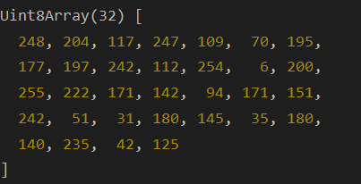
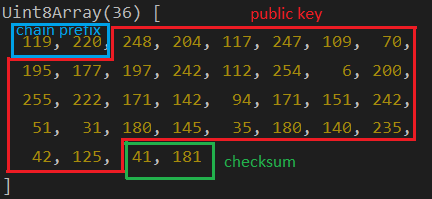
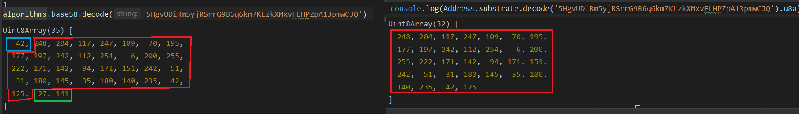

# Addresses: Substrate & EVM

An address represents an identity - usually of a person or an organization - capable of making transactions or holding funds. 
Although addresses are most often used to represent a person, that doesn't have to be the case. An address can be used to perform operations 
on behalf of a user or another entity or to perform operations autonomously. In addition, any single person or entity could have multiple
addresses for different purposes. All [our networks](../../../about/networks.md) are Substrate-based blockchains, and you can have specialized addresses for holding funds that 
are separate from addresses used for making transactions.

### Substrate addresses

Substrate enables you to use a single public key to derive multiple addresses, so you can interact with multiple chains without creating separate 
public and private key pairs for each network. By default, the addresses associated with the public key for an address use 
the Substrate [SS58 address format](https://docs.substrate.io/reference/glossary/#ss58-address-format). This address format is based on base-58 encoding. 
In addition to allowing you to derive multiple addresses from the same public key, [base-58 encoding](https://digitalbazaar.github.io/base58-spec/) has the following benefits:

* Encoded addresses consist of 58 alphanumeric characters.
* The alphanumeric string omits characters - such as 0, O, I, and l - that can be difficult to distinguish from each other in a string.
* Network information - for example, a network-specific prefix - can be encoded in the address.
* Input errors can be detected using a checksum to ensure the address is entered correctly.

Thus, a Substrate address contains a chain prefix, public key, and checksum, encoded using the base58 algorithm. The example below
demonstrates this in detail.

<Details>
<template v-slot:header>Example</template>
<template v-slot:body>

Let's take a Substrate address, e.g., `5HTC7UFtTbBkC7dWWFt6ec3db5LEahCHMqw6LBN5hXEeqDHm`. We can decode the address using the [@unique-nft/api](https://www.npmjs.com/package/@unique-nft/api) library. 

```ts:no-line-numbers
import {UniqueUtils} from '@unique-nft/api'

const Address = UniqueUtils.Address
  ...  
Address.substrate.decode('unjuYbCt4zchHzmr5vLFuFFCXRKAWLTMFPHEJJ3uyWsQ2VgEY')
// or
Address.substrate.decode('yGJ7zjEaVLKPVVM39VoHt1YQtwU2VCfGeRGHX4j2Ap8WzzB6L')
```

The result is the following. Please note that both calls give the same result since we receive a public key, which is the same in both addresses; they are equal, just presented in different formats (Unique and Quartz). 



Now, let's use another decoder that will provide not only a public key as a result. 

```ts:no-line-numbers
import {algorithms} from "@unique-nft/utils/address"

... 
algorithms.base58.decode('unjuYbCt4zchHzmr5vLFuFFCXRKAWLTMFPHEJJ3uyWsQ2VgEY')
``` 

The result below contains exactly the same public key (highlighted in red), a chain prefix, and a checksum. 
A chain prefix can also be represented by one value (i.e., for prefix 5, the first value of the 
array will be 42). This depends on how many bites are needed to store a prefix value.
Checksum is calculated using both prefix and public key. Thus, these values depend
on the chain prefix, as well. 





The reverse operation will show that the encoding and decoding work in both directions. 

```ts:no-line-numbers
algorithms.base58.encode(new Uint8Array( [
    119, 220, 248, 204, 117, 247, 109,  70, 195,
    177, 197, 242, 112, 254,   6, 200,
    255, 222, 171, 142,  94, 171, 151,
    242,  51,  31, 180, 145,  35, 180,
    140, 235,  42, 125, 41, 181
  ]))
// unjuYbCt4zchHzmr5vLFuFFCXRKAWLTMFPHEJJ3uyWsQ2VgEY
```

</template>
</Details>

The private key owner can change chain data only by signing a transaction with the private key and publishing it to the blockchain.
This data is stored inside the blockchain, and it is read-only for all other users.

<!---
Blockchain accounts are quite different from what we use for web2 accounts. They don't necessarily have any server data. Basically, the account consists of these things:
* _A private key_ (the seed phrase allows the generation of one) is stored by a user in secret.
* _Address_ (usually it is some hash or encoding of the public key) - publicly known.
* _Chain data_ associated with the address - in the case of Unique, it is all public.
-->

Each Substrate blockchain can register a custom prefix to create a chain-specific address type. For example, all Polkadot addresses start with 1, and all Kusama addresses start with a capital letter. All unregistered Substrate chains start with 5.

:warning: The default Substrate address format (starting from 5) also has the prefix equal to 42.

The prefixes that Unique Network uses:

- For Unique - **7391**, gives "**un**" at the beginning of the encoded address.
- For Quartz - **255**, gives "**yG**" at the beginning of the encoded address.
- For Opal - **42**, gives default "**5**" at the beginning of the encoded address.

### Ethereum addresses

There are two types of addresses in Ethereum: Externally Owned Address (EOA) and Contract Address.

**Externally Owned Address**

Externally Owned Address refers to an account with a public and private key pair that holds your funds.

An Ethereum address is a 42-character hexadecimal address derived from the last 20 bytes of the public key controlling the address with 0x appended in front. e.g. `0xee53Ae81b06Ed39Ac05B2cF2311F4b399E104Ba3`.

The Ethereum address is the "public" address you would need to receive funds from another party. To access funds in the address, you must have its private key. 
Kindly exercise a duty of care when handling your private key, as it can be used to access all the funds in an address.

**Contract Address**

Contract address refers to the address hosting a collection of code on the Ethereum blockchain that executes functions. These functions of a contract address are executed when a transaction with associated input data (contract interaction) is made to it.

The contract address is usually created when a contract is deployed to the Ethereum Blockchain.

Both Externally Owned and Contract Addresses share the same format of having 42 hexadecimal characters.

## Address Mirroring

#### Introduction

Address mirroring in blockchain is a process where an address from one blockchain network is represented in another network to facilitate interoperability. This is necessary because different blockchain networks, such as Ethereum and Substrate, use addresses of different lengths and formats. By creating mirrored addresses, these networks can communicate and interact seamlessly, allowing users to manage assets and perform transactions across multiple blockchains without compatibility issues.

Address mirroring in blockchain systems isn't perfectly symmetrical with respect to the mirroring side.

#### Key Length Discrepancies

- **Substrate Public Key Length**: 32 bytes
- **Ethereum Public Key Length**: 20 bytes

The difference in key lengths is the root cause of mirroring issues. In certain parts of the blockchain, only a 32-byte address is allowed, such as in balances and the "collection owner" field. Other fields implement a special structure containing either a Substrate or Ethereum address along with a flag indicating the address type.

- **Ethereum Mirror of Substrate Address**: The first 20 bytes of the Substrate address.
- **Substrate Mirror of Ethereum Address**: A hash of the Ethereum address.

These mirrors are synthetic constructs without private keys, making it impossible to sign anything with them. Essentially, they are verifiable bytes if the original address from which the mirror is derived is known.

#### Differences in Mirroring

1. **Eth -> Sub Mirror**:
  - The blockchain often doesn't natively support Ethereum addresses and requires significant modifications to handle them.
  - When interacting via Ethereum APIs, the blockchain calculates the Substrate mirror of the Ethereum address to return balances or deduct balances in the case of Ethereum transactions.
  - Smart contract calls operate more natively, with `msg.sender` being passed as it is.

2. **Sub -> Eth Mirror**:
  - This is rare and mainly used for calling smart contracts from Substrate.
  - The problem arises with invoking Solidity smart contracts from a Substrate address. A special Substrate extrinsic `evm.call` is used to facilitate this.
  - In this case, `msg.sender` must be populated with the Ethereum mirror of the Substrate address, which is the first 20 bytes of the Substrate public key.

When using an Ethereum address, the blockchain internally credits balances to the Substrate mirror of the Ethereum address. However, wallets like MetaMask and other Ethereum providers display the balance on the Ethereum address as is. This is because the blockchain itself performs the mirroring and returns the balance of the mirrored address when queried through Ethereum APIs.

#### Conclusion

Mirroring addresses is a necessary but effective measure. Users who always use Ethereum addresses can generally ignore the mirroring process and utilize the blockchain seamlessly.

## Live address encoder
You can always find Live address encoder in the [References](../../../reference/tools.md).
