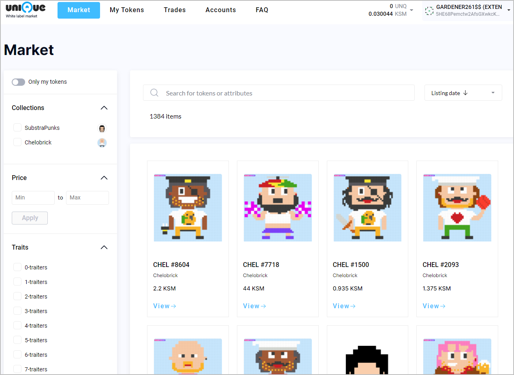
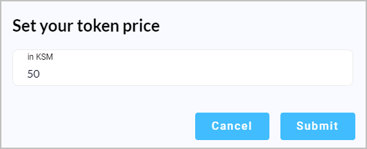

# Marketplace

## Overview

Unique Network white label market allows you to create a Unique Network account and connect using it, get KSM, purchase a desired token, transfer it to another person or sell it on the Market.

You can see the following section in the navigation bar (at the top of the Marketplace):

* _Market_ allows you to view the tokens collections, view the tokens available on the Market, and purchase them.
* _My tokens_ allow you to view and manage tokens that you own, including NFTs, RFTs, and Fungible tokens. In this tab, you can also transfer or sell your tokens.
* _Trades_ display the recent trades performed on the Market including your trade transactions.
* _FAQ_ contains the most frequently asked questions and answers to them.
 

## Viewing Tokens

Click the **Market** tab to see collections of NFTs, tokens and their attributes.

Available on the Market NFTs are displayed in the List panel located in the central part of the Market page. Usually, an NFT has a token card containing the picture, name, and price.
Click a NFT item to open the page that allows you to see more details for a particular NFT and buy it.

## Purchasing an NFT

ou can purchase an NFT in the Detailed token view. For this, follow these steps: 

1. Click the **Buy it** button in the Detailed token view.
2. In the **Authorize transaction** window, click the **Sign and Submit** button.
3. In the **Transaction** window, enter your account password.
   _Note:_ This window contains the Kusama address assigned to your account, and it is different from the address created with your Unique market account.
   
   To complete the process, you will need to enter your password again. Considering this, you may wish to check the **Remember my password for the next 15 minutes** checkbox.
   
4. Click **Sign the transaction**.
5. In the **Authorize the transaction** window, click **Sign and submit**.
6. In the **Transaction** window, enter your account password (if it was not remembered by the system on step 4) and click **Sign the transaction**.
7. Now, you are the token owner. The “**You own it!**” message displayed in the detailed view page for your NFT. Please note that you have two new buttons displayed now, which allow you to transfer and sell your token.
   
8. Click **My tokens** to verify that your token is displayed under the collection name. 

## Selling an NFT on the Market 

You can sell a token you own on the market To sell your token:

1. Click **My tokens**.
2. Click the token that you wish to sell to open it in the detailed view.
3. Click **Sell**.
4. In the **Authorize transaction** window, click **Sign and Submit**.
   
5. In the **Transaction** window, enter your account password and click **Sign the transaction**. To complete the process, you will later need to enter your password again. You may wish to check the **Remember my password for the next 15 minutes** checkbox.
6. In the screen that follows, enter your token price in KSM. Click **Submit**.
    
7. In the **Authorize transaction** window, click **Sign and Submit**.
8. In the **Transaction** window, click Sign the transaction **Sign the transaction**.
   

## Removing tokens from the sale

1. You can find and select the token you wish to remove from the sale. You can display only your tokens on the market by selecting the **My NFTs on sale** checkbox.
   
2. In the Detailed token view page, click the **Delist** button.
   
3. In the **Authorize transaction** window, click **Sign and Submit**.
4. In the **Transaction** window, enter your account password. Click **Sign the Transaction**.

Your token is now removed from sale on the Market. It is now again available to you for transferring and sale.

## Transferring tokens

1. You can transfer NFTs from your Unique Network account to any other account. To transfer a token:
2. Click your token that you wish to transfer to another address.
3. In the Detailed token view page, click Transfer.
   
4. In the **Transfer NFT** token window, enter the address to which you transfer the token and click the **Transfer token** button.
    :warning: Be careful with this operation as this transaction cannot be reverted!
5. In the **Authorize transaction** window, click **Sign and Submit**.
   
6. Enter your account password in the **Transaction** window. Click **Sign the transaction**.
   
7. Check the detailed view page to see the new owner address.

## Build a proof of concept Marketplace

The Marketplace installation guide with detailed instructions. Go to [the Github repository](https://github.com/UniqueNetwork/marketplace-docker/blob/master/README.md).