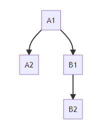
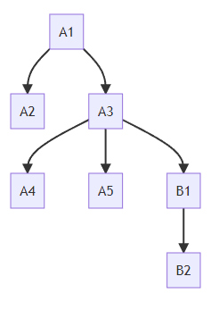

# Nesting

[[toc]] 

### Nesting settings

By default, nesting for a collection is disabled. To enable it we need to change the nesting rule. The Nesting rule is a part of the collection permissions.

```javascript
api.tx.unique.setCollectionPermissions(ACollectionId, {
   nesting: {tokenOwner: true}
});
```

With the nesting enabled, tokens can be nested as long as they share a common owner, but they can belong to different collections. So in a case where tokens A1 and  B1 share a common owner, a token from collection B (B1) can be nested under a token in collection A (A1).

However, this behavior can be restricted by imposing a list of allowed collections. This would ensure that only tokens from a restricted list of collections (defined by the collection IDs) can be nested:

```javascript
api.tx.unique.setCollectionPermissions(ACollectionId, {
   nesting: {tokenOwner: true, restricted: [ACollectionId, BCollectionId]}
);
```

This behavior can be reset by passing _null_ as a restricted list argument:

```js
api.tx.unique.setCollectionPermissions(ACollectionId, {
   nesting: {restricted: null}
);
```

You can extend the rights of nesting to collection administrators if any have been declared. When an administrator enables nesting, the owner of the collection is implicitly given nesting rights as well.

```javascript
api.tx.unique.setCollectionPermissions(ACollectionId, {
   nesting: {collectionAdmin: true}
);
```

Administrators can only nest tokens they own to the managed collection's tokens. However, they can nest into a token that is owned by someone else (owner or another administrator). If an administrator imposes a collection restriction list, this list will also extend to the owner, i.e. the owner must also obey collection restriction rules set forth by the administrator.

To disable nesting, we would use:

```javascript
api.tx.unique.setCollectionPermissions(ACollectionId, {
   nesting: {tokenOwner: false, collectionAdmin: false}
});
```

Once nesting is disabled, it will not be possible to nest new tokens into the bundle. The nested structure remains accessible to the root owner. Changing the nesting rule property does not affect the existing structure of the bundle in any way.


## RPC Methods

### 🔶 topmostTokenOwner

Obtain the root token owner for a token in a nested branch.

```javascript
api.rpc.unique.topmostTokenOwner(collectionId, tokenId)
```

Example: If in a case where _User_ is the owner of token A that has a nested child token B, that in turn has a nested child token C, this function is invoked with token C as the argument, it would return as the result the owner of token A, i.e. _User_.


### 🔶 tokenChildren

Obtain a list of all the direct descendants of a given token. A direct descendant is a child nested one layer deep.

```javascript
api.rpc.unique.tokenChildren(collectionId, tokenId)
```

The response obtained by invoking the call has the format:
> {token: childTokenId, collection: childTokenCollectionId}

Example: Let's consider a nested structure where tokens A1 and A2 belong to collection A and token B1 belongs to collection B

[//]: # (```mermaidjs)
[//]: # (graph TD;)
[//]: # (    A1-->A2;)
[//]: # (    A1-->B1;)
[//]: # (    B1-->B2;)
[//]: # (```)



By invoking this function with the ids of collection A and  token A1, a response would be:


>[{token: A2, collection: A}, {token: B1, collection: B}]

As presented in this example, the `tokenChildren` lists only A1 and B2 as they are direct, or first generation, or layer 1 of nesting depth descendants. Token B2 is a second-generation descendant or a layer two nested token. However, B2 will appear as a result of a call invoked with ids for collection B and token B1.

## Notes

Only a leaf node token in a bundle can be burned. A leaf node is a token that belongs to a branch and has no descendants. This rule implies that in order to burn a root of a branch you must burn all the leaf nodes in sequence first.

So in the example provided below, to burn the token A3 which is the root of a branch of descendants A5, A4, B1 and B2 it would be necessary to disassemble the branch, i.e. to burn the tokens in a specific order: B2, B1, A4, A5, A3.

[//]: # (```mermaidjs)
[//]: # (graph TD;)
[//]: # (    A1-->A2;)
[//]: # (    A1-->A3;)
[//]: # (    A3-->A4;)
[//]: # (    A3-->A5;)
[//]: # (    A3-->B1;)
[//]: # (    B1-->B2;)
[//]: # (```)



Non-empty collections cannot be burned.
