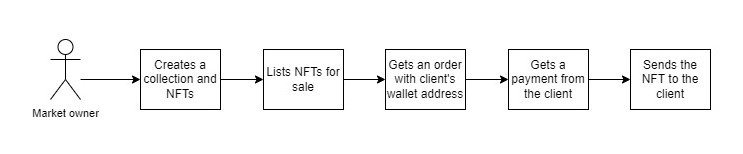
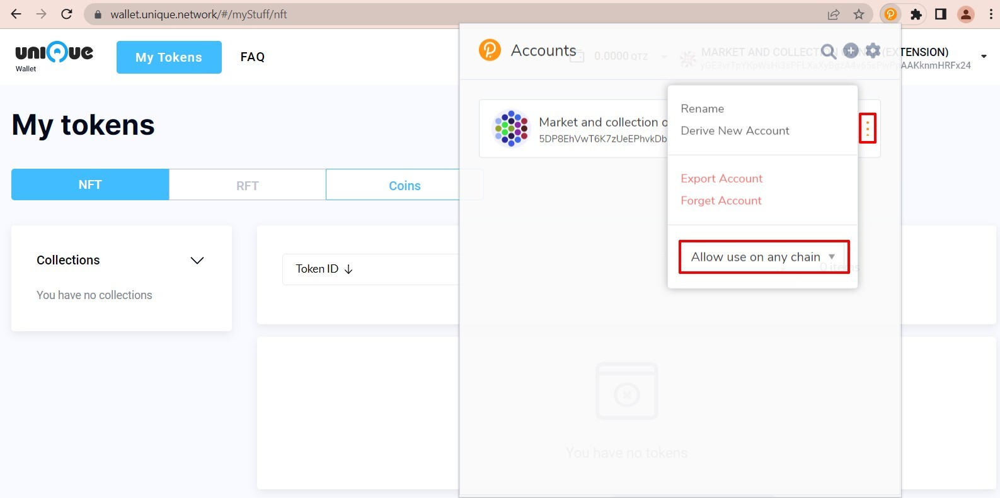
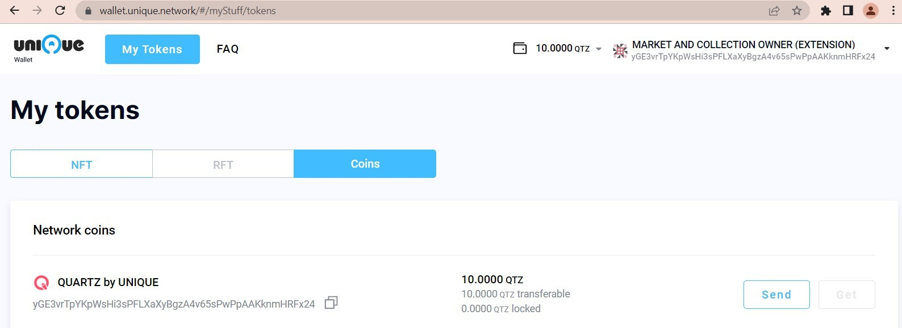
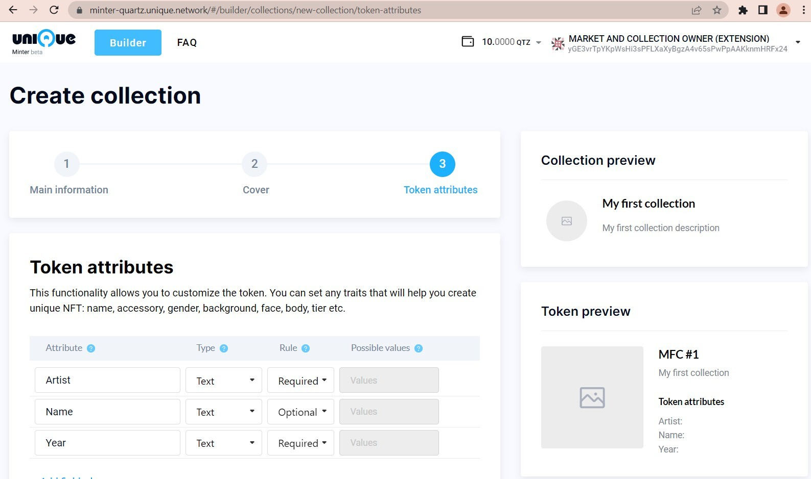
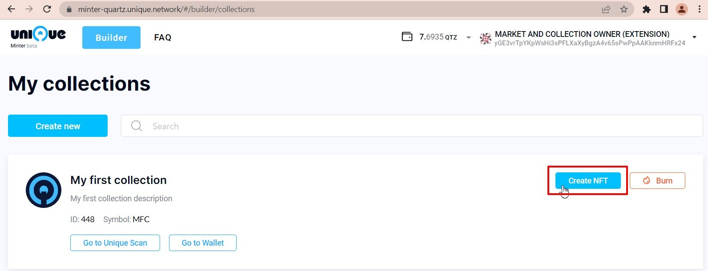
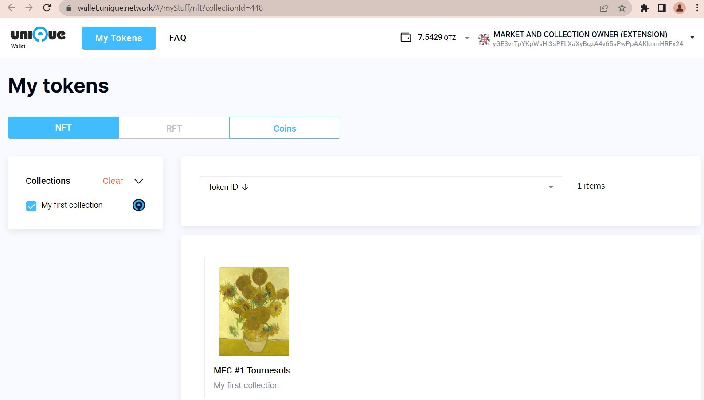

# NFT trading for classic e-commerce

This instruction was created to help owners and developers of e-commerce projects (markets) in quickly setting up an NFT marketplace.

It is quite obvious that the interest in NFTs is steadily increasing with time. The complexity of obtaining an NFT, on the other hand, is not being addressed and presents a barrier to mass adoption. The process presents a daunting challenge for a regular retail buyer: registering on a crypto exchange and buying cryptocurrency, going through the KYC, and so on. Even more difficulties arise for the market owner: an obligation to organize not only the acceptance of payments in cryptocurrency, but also solve many further technical and legal problems in interacting with it.

The purpose of this instruction is to show that selling NFTs can be made simple, for both the user and the market provider.

In comparison to a standard on-line retail product or services purchase, the experience only differs in the one-time wallet creation step for a first-time buyer.


The market only needs to change the last step of the usual sales process: instead of sending a request for shipment from the warehouse, make only one transaction in the blockchain.



You will need to follow a few simple steps to join the NFT-world:

- [1. Creating NFTs](#1-creating-nfts)
  - [1.1 Creating a market’s substrate wallet](#11-creating-a-markets-substrate-wallet)
  - [1.2 Getting QTZ tokens](#12-getting-qtz-tokens)
  - [1.3 Creating a collection and NFTs](#13-creating-a-collection-and-nfts)
- [2. Selling preparation](#2-selling-preparation)
  - [2.1 Connecting to the Unique SDK](#21-connecting-to-the-unique-sdk)
  - [2.2 Getting information about a collection, an NFT and it’s owner](#22-getting-information-about-a-collection-an-nft-and-its-owner)
  - [2.3 Getting the customer's substrate wallet address](#23-getting-the-buyers-substrate-wallet-address)
  - [2.4 Getting the wallet address QTZ balance](#24-getting-the-wallet-address-qtz-balance)
- [3. Sending an NFT to the customer](#3-sending-an-nft-to-the-buyer)

---

## 1. Creating NFTs
### 1.1 Creating a market’s substrate wallet

A market facilitates the trade of NFTs. In doing so it needs to store and transfer NFTs and to do this it needs a dedicated address. Unique network operates with 'Substrate' ecosystem multichain wallets. A Substrate wallet address may have different representations in each chain, but it will always refer to the same wallet. Another way of saying this is: all the different address formats share a common underlying private key. Address transformations can be viewed on <a href="https://polkadot.subscan.io/tools/format_transform" target="_blank">Subscan</a>.

The ways to create a Substrate wallet are described on <a href="https://wiki.polkadot.network/docs/learn-account-generation" target="_blank">Polkadot wiki</a>. We highly recommend using the Polkadot{.js} Browser Extension for the market’s wallet creation and usage: this method will allow you to quickly interact with any of the Unique blockchain tools.

Warning: Exercise extreme precaution in handling your wallet seed phrase! Store it in a safe and inaccessible place known only to you.


To check if the wallet you’ve created using the link above is ready for the upcoming steps, please:
- make sure that using Chrome or Firefox desktop with the Polkadot{.js} Browser Extension you’ve set your wallet setting to `allow use on any chain`.



- go to <a href="https://wallet.unique.network/" target="_blank">Unique wallet</a> and allow the page to connect to your Polkadot{.js} Browser Extension. Make sure you see your wallet connected.


---
### 1.2 Getting QTZ tokens

Any transaction (creating a collection or NFT, transfer, etc.) in any blockchain requires a gas fee payment. Fortunately, the Quartz network fees are extremely low and to follow all the steps described in this instruction you have to have less than 10 QTZ in your market’s wallet.

You can get QTZ on the <a href="https://www.mexc.com/exchange/QTZ_USDT" target="_blank">MEXC exchange</a> and transfer it to the wallet address you created inthe previous step.

You can always check your balance using an <a href="https://wallet.unique.network/" target="_blank">Unique wallet</a> or <a href="https://quartz.subscan.io/" target="_blank">Subscan</a>.



---
### 1.3 Creating a collection and NFTs

All NFTs in the Quartz network are organized in collections. You can create as many collections as you need and organize them by any criteria: one collection per market/artist/album/event/theme etc. Once a collection is created, you can mint the NFTs that belong to it.

There are several ways to create a collection with NFTs:

- using <a href="https://minter-quartz.unique.network/" target="_blank">Unique Minter</a>
- using <a href="https://github.com/UniqueNetwork/unique-sdk" target="_blank">Unique SDK</a>

We recommend using a <a href="https://minter-quartz.unique.network/" target="_blank">Unique Minter</a>, since it has an intuitive interface that will allow you to create your first collections in a straightforward manner. You will have to set the:

- collection name, description and cover image;
- token attributes. In this step you will  create a list of  the NFT attributes specific to the collection (its unique collection properties). For example, let’s consider a tokenized artwork NFT collection. The attributes of choice for every NFT in such a collection would, among other things, be the artist's name, the name of the work and the year of its creation. We would accordingly name the attribute fields ‘Artist’, ‘Work’, ‘Year’. In our example let’s say the NFT has these values: ‘Vincent Willem van Gogh’ for ‘Artist’, ‘Tournesels’ for ‘Work’ and ‘1888’ for ‘Year’. Each of the NFT property fields would be populated with the appropriate data during the preparation for the mint. Every following NFT would have a different data set for these fields appropriate to the tokenized artwork.



When the collection is created, you can follow with minting (creating) NFTs in it.



You can always viewall your NFTs in the <a href="https://wallet.unique.network/" target="_blank">Unique wallet</a>.



_Note: After you’ve created a Collection and NFTs, we suggest saving their IDs to your market database, you will need them to transfer NFTs to the buyer's address._

---
## 2. Selling preparation

### 2.1 Connecting to the Unique SDK

Unique SDK provides an easy way to connect to the Quartz Network. We recommend the following approaches:

- Connect via <a href="../../packages/web" target="_blank">HTTP REST API</a> (public endpoints or own service)
- Install <a href="../../packages/sdk" target="_blank">NPM Package</a>

In order to execute transactions (NFT minting, NFT transfer, etc.) a seed phrase of the collection’s owner is required. Please be careful with passing this parameter: we provide a way to sign transactions on public endpoints for specific needs, but this is not a recommended approach for most cases. Signing transactions on your service’s side is a much more secure way to do this, and the recommended approach.

---
### 2.2 Getting information about a collection, an NFT and it’s owner

To display information about a collection or NFT on your site, you only need the Collection ID and NFT ID:

<details>
  <summary>via @unique-nft/sdk </summary>

  ```javascript
    import '@unique-nft/sdk/tokens';
    
    const collectionId = 1; // Provide the Collection ID
    const tokenId = 3456; // Provide the Token ID
    const collection = await sdk.collections.get({
      collectionId,
    });
    const token = await sdk.tokens.get({
      collectionId,
      tokenId,
    });
  ```
</details>

<details>
  <summary>via HTTP REST API</summary>
  
#### Get collection data

  ```shell
    curl -X 'GET' \
      'https://web-quartz.unique.network/collection?collectionId=1' \
      -H 'accept: application/json'
  ```

#### Get token data

  ```shell
    curl -X 'GET' \
      'https://web-quartz.unique.network/token?collectionId=1&tokenId=3456' \
      -H 'accept: application/json'
  ```
</details>

_Note: You can save the received data to your database, but we recommend storing only the IDs and wallet addresses, getting the remaining data directly from the network so that it is always up to date._

---
### 2.3 Getting the customer's substrate wallet address

To receive an NFT, the buyer needs to have a Substrate wallet. You can choose from two options on how to guide the user through the wallet creating process:

- Direct the user to the Polkadot{.js} Browser Extension installation tutorial based on the <a href="https://wiki.polkadot.network/docs/learn-account-generation" target="_blank">Polkadot wiki</a>. Another option would be  one of the many existing <a href="https://www.youtube.com/watch?v=sy7lvAqyzkY" target="_blank">video tutorials</a> available on YouTube

-  Adding a wallet creation to your own interface as we did in our own wallet (check out the ‘Create account’ at <a href="https://wallet.unique.network/#/accounts" target="_blank">Unique wallet: 'Accounts' page</a>).

_Note: You should never ask for or store the user's wallet credentials data (other than a public address). The user is obliged to independently take care of the safety of his wallet and seed phrase in order to be able to interact in any way with his NFTs on your platform or any other service, for that matter._

Please note that unlike in the case of a user using the Polkadot{.js} Browser Extension, the user that creates a wallet via your site’s UI will not be able to connect so quickly to other Unique blockchain tools to explore or interact with their NFTs.

If you chose the second option please use this <a href="./javascript/generate-account-and-export-keyfile.js" target="_blank">code example</a>.

Once the user’s wallet address becomes available (after initial creation), it will be possible to save it in your database and reuse it for future purchases.

---
### 2.4 Getting the wallet address QTZ balance

<details>
  <summary>via @unique-nft/sdk </summary>

  ```javascript
    import '@unique-nft/sdk/balance';
    const address = '5GrwvaEF5zXb26Fz9rcQpDWS57CtERHpNehXCPcNoHGKutQY'; // Provide address of collection owner 
    const balance = await sdk.balance.get({
      address,
    });
  ```
</details>

<details>
  <summary>via HTTP REST API</summary>


  ```shell
    curl -X 'GET' \
      'https://web-quartz.unique.network/balance?address=5GrwvaEF5zXb26Fz9rcQpDWS57CtERHpNehXCPcNoHGKutQY' \
      -H 'accept: application/json'
  ```

</details>

---
## 3. Sending an NFT to the buyer

<details>
  <summary>via @unique-nft/sdk </summary>

  ```javascript
    import '@unique-nft/sdk/tokens';
    import { Sdk } from '@unique-nft/sdk';
    import { createSigner } from '@unique-nft/sdk/sign';

    const signer = await createSigner({
      seed: '//Alice', // Provide collection owner's seed phrase
    });
    
    const sdk = await Sdk.create({
      signer,
      chainWsUrl: 'wss://quartz.unique.network',
      ipfsGatewayUrl: 'https://ipfs.unique.network/ipfs/',
    });

    const from = '5GrwvaEF5zXb26Fz9rcQpDWS57CtERHpNehXCPcNoHGKutQY'; // Provide collection owner's address
    const to = '5FHneW46xGXgs5mUiveU4sbTyGBzmstUspZC92UhjJM694ty'; // Provide customer's address
    const collectionId = 1; // Provide the Collection ID
    const tokenId = 3456; // Provide the Token ID
    const extrinsic = await sdk.tokens.transfer({
      from,
      to,
      collectionId,
      tokenId,
    });
    const signature = await sdk.extrinsics.sign(extrinsic);
    await sdk.extrinsics.submit({
      ... extrinsic,
      ... signature,
    });
  ```
</details>

<details>
  <summary>via HTTP REST API</summary>

#### Build transaction

Provide collectionId, tokenId and addresses of collection owner and customer.

  ```shell
    curl -X 'PATCH' \
        'https://web-quartz.unique.network/token/transfer' \
        -H 'accept: application/json' \
        -H 'Content-Type: application/json' \
        -d '{
        "collectionId": 1,
        "tokenId": 3456,
        "from": "5GrwvaEF5zXb26Fz9rcQpDWS57CtERHpNehXCPcNoHGKutQY",
        "to": "5FHneW46xGXgs5mUiveU4sbTyGBzmstUspZC92UhjJM694ty"
      }'  
  ```
#### Sign transaction

We provide a way to sign transactions on public endpoints for specific needs, but we do not recommend using it for most cases. We highly recommend signing transactions on your service’s side.

Put previous response and add header: `Authorization: Seed //Alice` with collection owner's seed 

  ```shell
    curl -X 'POST' \
        'https://web-quartz.unique.network/extrinsic/sign' \
        -H 'accept: application/json' \
        -H 'Authorization: Seed //Alice' \
        -H 'Content-Type: application/json' \
        -d '{
          "signerPayloadJSON": {
            "specVersion": "0x000e0da8",
            "address": "yGHXkYLYqxijLKKfd9Q2CB9shRVu8rPNBS53wvwGTutYg4zTg",
            "blockHash": "0xf4735c218e3fa7aa6f943cb09d69261c4a036c741bd3525a719a1a7fd28c86a0",
            "blockNumber": "0x000f3aea",
            "era": "0xa400",
            "genesisHash": "0xcd4d732201ebe5d6b014edda071c4203e16867305332301dc8d092044b28e554",
            "method": "0x3d13008eaf04151687736326c9fea17e25fc5287613693c912909cb226aa4794f26a4801000000800d000001000000000000000000000000000000",
            "nonce": "0x00000000",
            "signedExtensions": [
              "CheckSpecVersion",
              "CheckGenesis",
              "CheckMortality",
              "CheckNonce",
              "CheckWeight",
              "ChargeTransactionPayment"
            ],
            "tip": "0x00000000000000000000000000000000",
            "transactionVersion": "0x00000001",
            "version": 4
          },
          "signerPayloadRaw": {
            "address": "yGHXkYLYqxijLKKfd9Q2CB9shRVu8rPNBS53wvwGTutYg4zTg",
            "data": "0x3d13008eaf04151687736326c9fea17e25fc5287613693c912909cb226aa4794f26a4801000000800d000001000000000000000000000000000000a4000000a80d0e00cd4d732201ebe5d6b014edda071c4203e16867305332301dc8d092044b28e554f4735c218e3fa7aa6f943cb09d69261c4a036c741bd3525a719a1a7fd28c86a0",
            "type": "payload"
          },
          "signerPayloadHex": "0x3d13008eaf04151687736326c9fea17e25fc5287613693c912909cb226aa4794f26a4801000000800d000001000000000000000000000000000000a4000000a80d0e00cd4d732201ebe5d6b014edda071c4203e16867305332301dc8d092044b28e554f4735c218e3fa7aa6f943cb09d69261c4a036c741bd3525a719a1a7fd28c86a0"
        }'  
  ```

#### Submit transaction

Merge responses from two previous operations and send it to `/extrinsic/submit`

```shell
    curl -X 'POST' \
        'https://web-quartz.unique.network/extrinsic/sign' \
        -H 'accept: application/json' \
        -H 'Authorization: Seed //Alice' \
        -H 'Content-Type: application/json' \
        -d '{
          "signerPayloadJSON": {
            "specVersion": "0x000e0da8",
            "address": "yGHXkYLYqxijLKKfd9Q2CB9shRVu8rPNBS53wvwGTutYg4zTg",
            "blockHash": "0xf4735c218e3fa7aa6f943cb09d69261c4a036c741bd3525a719a1a7fd28c86a0",
            "blockNumber": "0x000f3aea",
            "era": "0xa400",
            "genesisHash": "0xcd4d732201ebe5d6b014edda071c4203e16867305332301dc8d092044b28e554",
            "method": "0x3d13008eaf04151687736326c9fea17e25fc5287613693c912909cb226aa4794f26a4801000000800d000001000000000000000000000000000000",
            "nonce": "0x00000000",
            "signedExtensions": [
              "CheckSpecVersion",
              "CheckGenesis",
              "CheckMortality",
              "CheckNonce",
              "CheckWeight",
              "ChargeTransactionPayment"
            ],
            "tip": "0x00000000000000000000000000000000",
            "transactionVersion": "0x00000001",
            "version": 4
          },
          "signerPayloadRaw": {
            "address": "yGHXkYLYqxijLKKfd9Q2CB9shRVu8rPNBS53wvwGTutYg4zTg",
            "data": "0x3d13008eaf04151687736326c9fea17e25fc5287613693c912909cb226aa4794f26a4801000000800d000001000000000000000000000000000000a4000000a80d0e00cd4d732201ebe5d6b014edda071c4203e16867305332301dc8d092044b28e554f4735c218e3fa7aa6f943cb09d69261c4a036c741bd3525a719a1a7fd28c86a0",
            "type": "payload"
          },
          "signerPayloadHex": "0x3d13008eaf04151687736326c9fea17e25fc5287613693c912909cb226aa4794f26a4801000000800d000001000000000000000000000000000000a4000000a80d0e00cd4d732201ebe5d6b014edda071c4203e16867305332301dc8d092044b28e554f4735c218e3fa7aa6f943cb09d69261c4a036c741bd3525a719a1a7fd28c86a0",
          "signature": "0x0152efcc1121089aa5e8d0850c6cd55f56cd236afa1a67f694217de2909356da1adffcfceeb59e1b118cc8d521cd51b219e1626bd0a2e4c47fb03f81ae53f63084",
          "signatureType: "sr25519"
        }'  
  ```

</details>


---

## Restrictions and caveats

We have tried to make this particular instruction as simple as possible, and there are some restrictions and caveats that go with this approach: 

- Only "primary sales" are considered in this document (a sale by the creator of NFT to the first buyer). If you want to allow your users to resell purchased NFTs, additional steps need to be considered.
- It is assumed that the creator of NFTs is the market itself. If you want to allow someone else to create and list their own NFTs independently, additional steps are required.
- This document does not go into any details regarding payment-related issues.
- The procedures described here refer to operations executed on the Quartz parachain. The Quartz parachain is one of the two production blockchains of the Unique ecosystem within the larger Polkadot multichain ecosystem. You can learn more about Quartz on <a href="https://unique.network/" target="_blank">Unique.network</a>.

We would love to hear from you if you have any suggestions regarding this manual or any questions otherwise. Should you wish to get in touch you can do so via our <a href="https://discord.gg/jHVdZhsakC" target="_blank">Discord</a> Server or <a href="https://t.me/unique_network_support" target="_blank">Telegram</a>. 
