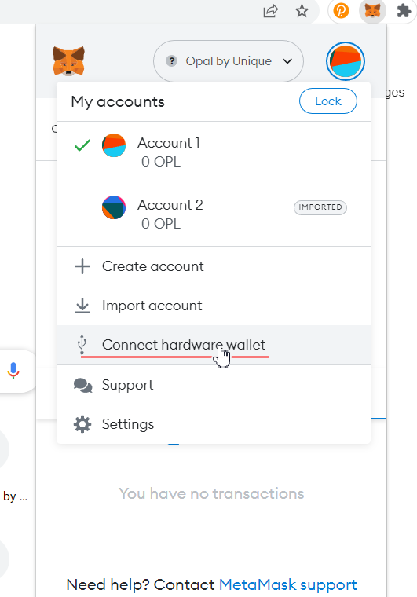
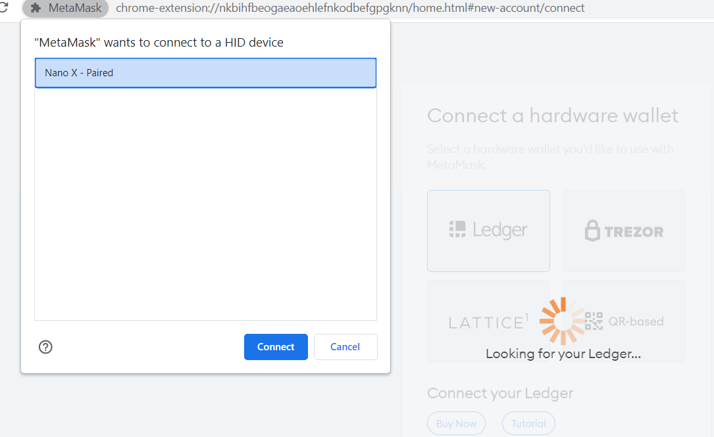
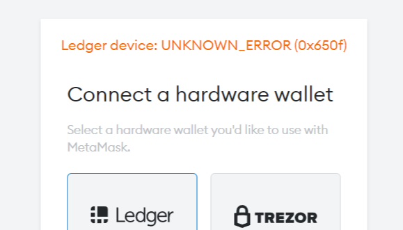
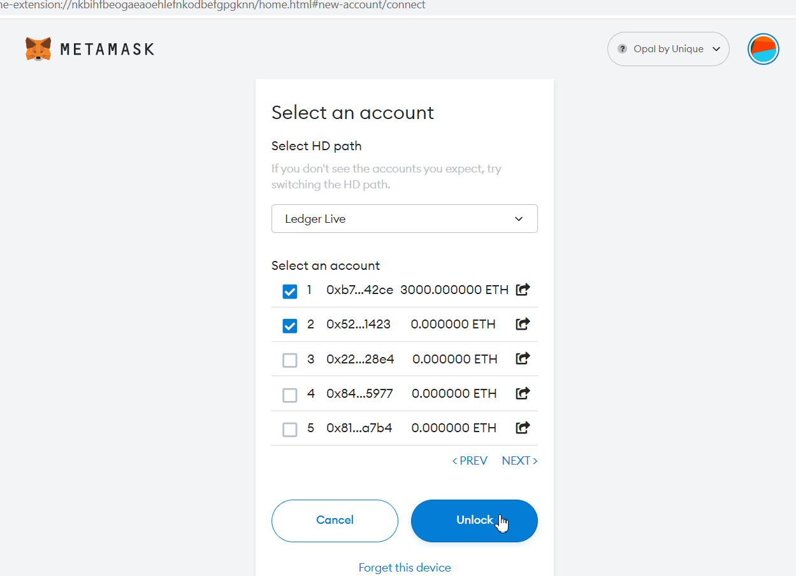
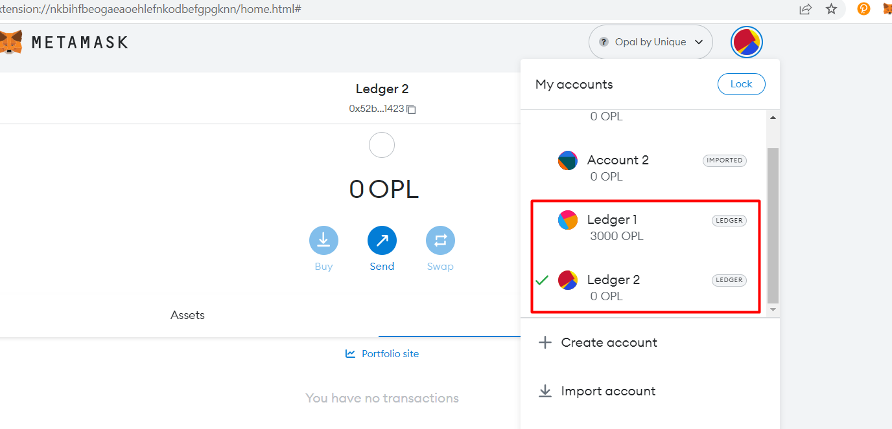
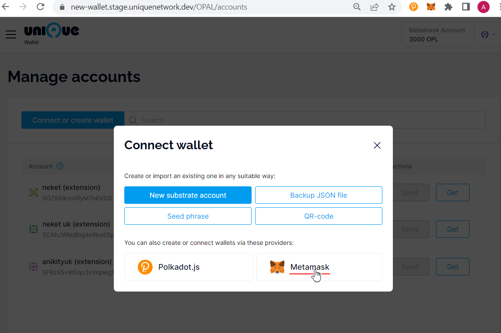
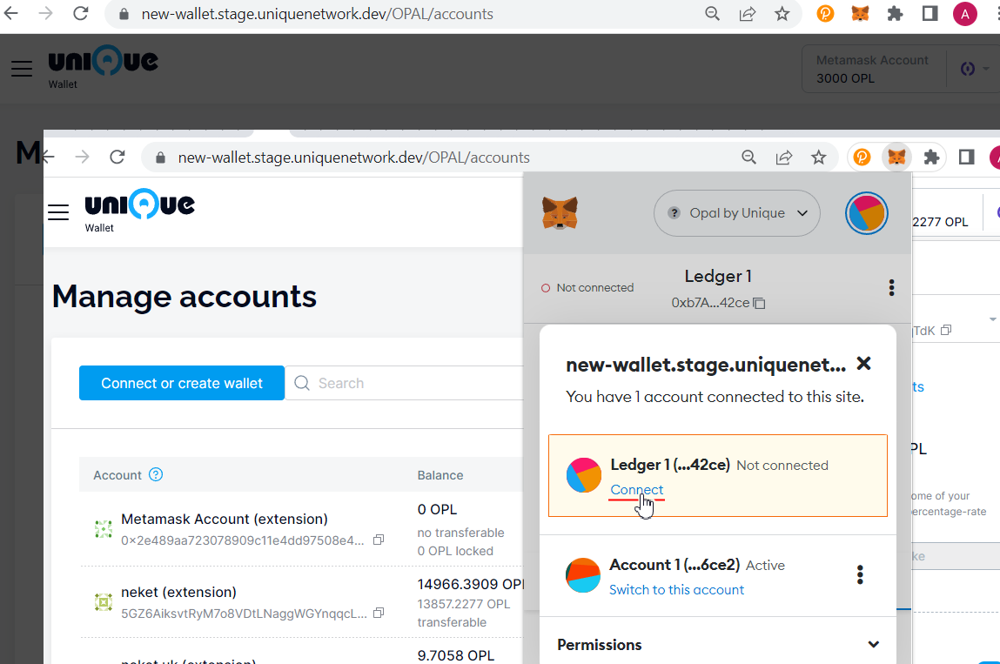

# How to connect Ledger to Wallet

Download the [Ledger app](https://www.ledger.com/start) to connect to your Ledger device.

Following the instructions in the app create a new account through "Set up as new device" or connect an existing one through "Restore from Recovery phrase". It's required to enter PIN and Recovery phrase.

To add an account you would have to connect Ledger Nano to your PC and install the related app, for instance Ethereum
### Connect Ledger to Metamask

1. Open metamask plugin, click on account icon, then click "Connect hardware wallet"

2. Select Ledger in the next step, connect Ledger Nano to your PC and press Continue
3. In modal window select your device, connect it

*. Sometimes while connecting an error might occur. Just retry

4. Select an account or few and press Unlock

5. Account connected

### Connect Ledger to Wallet via Metamask

You can use your Ledger account in Wallet within Metamask plugin
1. Open "Manage accounts" page in Wallet
2. Then open "Connect account" popup window and choose Metamask provider

3. In Metamask plugin connect the account you need

### How to keep tokens in Ledger

Yet there is no minting available for Metamask in Wallet UI. Still you might want to mint an NFT with any other account, e.g. polkadot's and then transfer it to your Ledger connected via Metamask.

