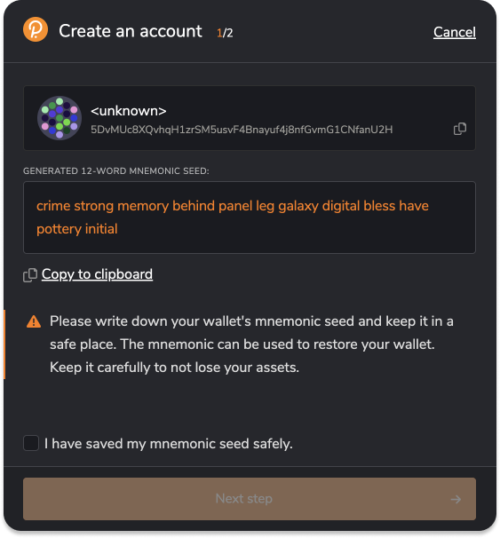

# Mass NFT minting guide

## 👩‍🎓 Who is this guide for

This tutorial is for those who already have token images and want to create a large collection of hundreds or thousands of tokens. You will learn how to create a collection and mint a large number of tokens in less than 10 minutes.

This guide is perfect for beginners who don't have extensive programming knowledge. However, having some familiarity with using the console will be helpful.

> 💡 If you want to create a generative NFT collection, make use of [this guide](./generative-nft.md).

By completing of this tutorial, you will have a clear understanding of how to use scripts to mint vast collections, illustrated through the example of the [Space Animals collection](https://uniquescan.io/opal/collections/1883).


## Before we start

1. For this tutorial, you will need node.js, git, and Visual Studio Code installed on your computer. If you haven't worked with git, node, and npm before, we recommend reading our [brief guide](./setup-environment.md) to configure your environment correctly.
2. Prepare minting scripts according to [this instruction](./prepare-scripts.md)

## 🖼 Step-1: Prepare your images

Place your images in the `data` folder. The image names should consist of a `symbol` and a sequential number that determines the token's position in the collection. For this tutorial, the token symbol is `SA`. Therefore, `sa1.png` will be the first token in the collection, `sa2.png` will be the second token, and so on.

Additionally, place an image named `cover.png` in the data folder, which will serve as the cover image for the collection.

We have already prepared ten images stored in the `data` folder. Feel free to use them as they are or replace them with your images.


> ✏️ In the `config.js` file, specify the prefix for your collection by setting the value of the `symbol` property (max 4 symbols).

## 📇 Step-2: Prepare collection metadata

Metadata is basic information that describes NFT or collection, such as its name, description, token prefix, and other relevant details.

> ✏️ In the `config.js` file, fill in the fields `collectionName` (max 64 symbols), `collectionDescription` (max 256 symbols).
>
> If you want to make nesting available for your collection, set the `nesting` property.

After the creation of the collection metadata file, we need to create metadata of our NFTs

## 👨‍🎨 Step-3: Describe NFT attributes

We will encode NFT properties in CSV format. The first value in the header should be id, representing the sequential number of each token. Following that, list all the existing properties of the collection that were set in the previous step.

**Example**

```csv:no-line-numbers
id,creature,description
1,Bear,"A bear perched in the sky, amid a sea of stars"
2,Elephant,A skyward elephant
3,Giraffe,A blue giraffe that fascinates the eye.
...
```

The simplest way to create such a structure is to use [Google Sheets](https://docs.google.com/spreadsheets/d/1712bCiuCKYJOXsN9rIGW_QKJbMt312mw-2WQlSpXMzE/edit#gid=1148781766).

Complete the table by listing all the properties of your collection in the header. On each subsequent row, list the properties that will be added to the token with the corresponding id (max 32768 symbols). Export the filled values by clicking on `File - Download - Comma Separated Values (.csv)`


> <font size=1> In the image above, the data is filled in to create 10 tokens with two properties, `creature` and `description`. </font>

> ✏️ Rename the exported file to `nfts.csv` and save it in the `data` folder.

We have already included a file named `nfts.csv` with data for 10 NFTs. You can use this file as it is or add more tokens and properties.


## ⛓ Step-4: Prepare Substrate Account

### 4.1 Generate address and seed phrase

You will need an address with a balance to create the collection and tokens. If you don't have an account yet, you may create it with [Polkadot{.js} extension for Chrome](https://polkadot.js.org/extension/).

- Open the Polkadot{.js} extension in your browser.
- Look for the "+" icon and click on it.
- A menu will appear. From the options presented, select "Create new account".
- A 12-words mnemonic phrase will be generated. Make sure to save it securely.



> ✏️ In the `config.js` file, fill in the `ownerSeed` field.
>
> ❗️ Do not commit your secrets, such as `ownerSeed`, to version control! We have added `config.js` to the `.gitignore` file for this purpose.

### 4.2 Get some tokens

For this guide, we are using Opal Network, and you can obtain OPL tokens for free by using [Telegram faucet bot](https://t.me/unique2faucet_opal_bot). You will have to provide your address (not a mnemonic phrase!). Click on the circle icon next to your account in the Polkadot extension to copy it.

> 💡 If you are ready to mint tokens on the mainnet (Quartz or Unique), make sure to change the endpoint variable in the config.js file. Set it to `https://rest.unique.network/quartz/v1` for Quartz or `https://rest.unique.network/unique/v1` for Unique.
>
> - Quartz Network tokens (QTZ) are available on [MEXC](https://www.mexc.com/ru-RU/exchange/QTZ_USDT?_from=search)
>
> - For Unique Network tokens (UNQ) you can visit [Huobi](https://www.huobi.com/en-us/trade/unq_usdt?type=spot)

## 💎 Step-5: Create Collection and NFTs

### 5.1 Upload images to IPFS

In simple terms, the Inter-Planetary File System (IPFS) is a distributed file storage protocol that enables a network of computers to store any data in a reliable and unchangeable manner.

Open the VS Code terminal and execute the following command:

```sh:no-line-numbers
node 1-upload-images.js
```

After a short time, you will see the result of executing the command:


This script will pack all the images into a zip archive and save it as data/archive.zip. Then it will upload it to IPFS. Ensure that all your files are successfully uploaded by visiting the link provided in the console output.

> ✏️ In the `config.js` file, fill in the `fileUrl` set provided link.

### 5.2 Create a collection

We have set the collection metadata in the previous steps. Double-check that the name, description and symbol fields are filled in `config.js`. Afterward, execute the script.

```sh:no-line-numbers
node 2-create-collection.js
```

After a short time, you will see the result of executing the command:

```txt:no-line-numbers
🚀 Creating collection... done!
❗️❗️❗️ add to "config.js" collectionId: 1877
```

> ✏️ In the `config.js` file, fill in the `collectionId` set provided value.

Your collection has been created, and you can check it on your [wallet](https://wallet.unique.network/) or on [uniquescan.io](https://uniquescan.io/). Your collection doesn't have any NFTs yet, so let's create some.

### 5.3 Create NFTs

We have set the token metadata in the previous steps in the nfts.csv file. Check again if it exists. After that, execute the following script.

```sh:no-line-numbers
node 3-create-nfts.js
```

After a short time, you will see the result of executing the command:

```txt:no-line-numbers
🚚 successfully created 1 part of NFT's
🚀 Creating NFTs... done!
Token Ids: 1, 2, 3, 4, 5

🔗 You can find your collection and tokens here: https://uniquescan.io/opal/collections/1877
```

Your collection and tokens have been successfully created! You can find it in your [wallet](https://wallet.unique.network/). Or you can connect to [Unique Market](https://unqnft.io/) and list your NFTs for sale.

Next, you can learn

[How to mass list tokens for sale](./mass-listing.md)
