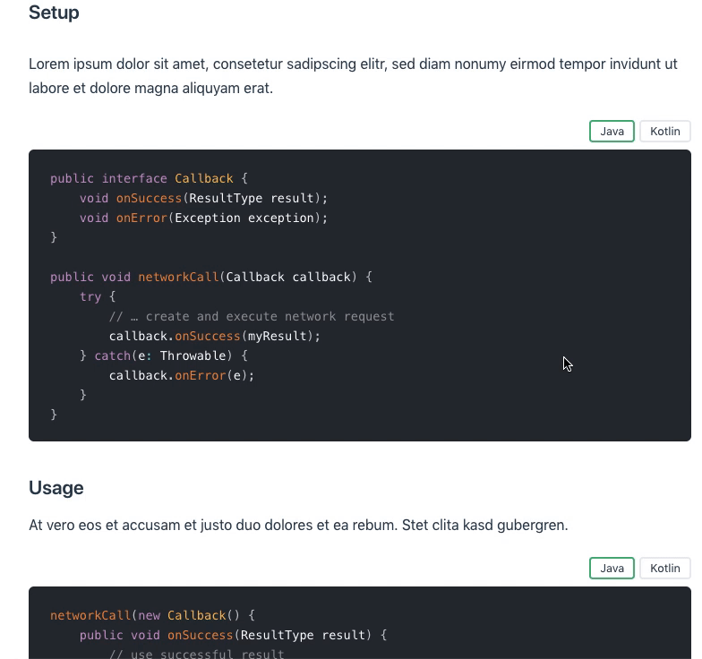

# vuepress-plugin-code-switcher
Component that allows having synchronized language switchable code blocks (e.g. to switch between Java and Kotlin examples). Selected languages are persisted to local storage to have language selection be permanent across page requests.

This plugin supports both Vuepress 1 and 2. Since Vuepress 1 plugins are incompatible with Vuepress 2 I try to maintain the plugin for both Vuepress versions. Those plugin versions can be seen in different GitHub branches as shown below.

| | Vuepress 1 | Vuepress 2 |
| -- | --- | --- |
| npm | Versions `1.x.x` | Versions `2.x.x` |
| GitHub | [`vuepress-1` Branch](https://github.com/padarom/vuepress-plugin-code-switcher/tree/vuepress-1) | [`main` Branch](https://github.com/padarom/vuepress-plugin-code-switcher/tree/main) |

## Demo
A live demo is available at https://code-switcher.padarom.xyz.


## Installation
**These instructions are only valid for Vuepress 2. If you use Vuepress 1, see [here](https://github.com/padarom/vuepress-plugin-code-switcher/blob/vuepress-1/README.md#installation).**

```
$ npm install vuepress-plugin-code-switcher@~2.0 --save
```

After installing, add it to your Vuepress configuration's plugin list:

```ts
import { codeSwitcherPlugin } from 'vuepress-plugin-code-switcher'

export default {
    // Your remaining configuration ...
    plugins: [ codeSwitcherPlugin(/* your config options go here */) ],
}
```

### Usage
````markdown
<CodeSwitcher :languages="{js:'JavaScript',ts:'TypeScript'}">
<template v-slot:js>

```js
module.exports = function (str) {
    return typeof str === 'string' && str.trim() === str
}
```

</template>
<template v-slot:ts>

```ts
export default function isString (str: string) : str is string {
    return typeof str === 'string' && str.trim() === str
}
```

</template>
</CodeSwitcher>
````

> The extra newline between the `<template>` tags and their content is necessary if you want to have Markdown interpreted within the component.

### With options
If you have a lot of code switchers in your documentation you might not want to
specify your languages every single time. Therefore you can instantiate the
plugin with options and name the default languages for a given group:

```js
import { codeSwitcherPlugin } from 'vuepress-plugin-code-switcher'

export default {
    // Your remaining configuration ...
    plugins: [
        codeSwitcherPlugins({
            groups: {
                default: { ts: 'TypeScript', js: 'JavaScript' },
                jvm: { java: 'Java', kotlin: 'Kotlin', jruby: 'JRuby' },
            },

            // You can also specify a custom name for the code switcher component.
            // If chaning the name like so, you then use the component as <CustomCodeSwitcher>
            // in your markdown code
            componentName: 'CustomCodeSwitcher',
        })
    ],
}
```

You then want to give your `CodeSwitcher` components the `name` prop to match them
with the configured language group. If you omit the `name` prop, it uses the group
named `default`.

````markdown
<!-- Uses the "default" languages defined above -->
<CodeSwitcher>
<template v-slot:js>
    <!-- ... (see above) -->
</template>
<template v-slot:ts>
    <!-- ... (see above) -->
</template>
</CodeSwitcher>

<!-- Uses the "jvm" languages defined above -->
<CodeSwitcher name="jvm">
<template v-slot:java>
    <!-- ... (see above) -->
</template>
<template v-slot:kotlin>
    <!-- ... (see above) -->
</template>
<template v-slot:jruby>
    <!-- ... (see above) -->
</template>
</CodeSwitcher>
````

#### Props
| Prop | Description | Type | Default |
| ----- | ----- | ---- | ---- |
| languages | The languages that can be switched between. The object expects shorthands as keys and the tab title as values. The shorthands will also be used as slot names | Object | --- |
| name | All code switchers on one page with the same name will be synchronized. When using the `groups` plugin option, this will also determine the default value for the `languages` prop. | String | `'default'` |
| isolated | if true, this block will not synchronize with any others or load/save its state to/from localstorage | Boolean | `false` |
